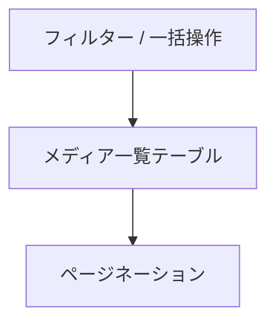

<!--
目的：「管理画面のレイアウト、各機能」の明文化
-->

# S2J MediaLibrary Date Corrector - 管理画面の UI 仕様

## 画面概要

本プラグインは、WordPress の「メディア > ライブラリ」一覧画面を拡張し、メディアの「日付 (post_date) 」とファイルパス由来の年月との不整合を可視化・補正する機能を提供する。

既存の一覧テーブル (List View) に対して以下を追加する：

* 補助カラム (年月 (パス) /差分)
* 一括操作 (Bulk Action)
* 行単位操作 (Row Action)
* 補助ボタン (差分抽出など)

本プラグインは既存UIを拡張する形で実装し、標準操作との整合性を維持する。

## レイアウト構成

画面は以下の構成とする：

* 上部：フィルター / Bulk Actions
* 中央：メディア一覧テーブル
* 下部：ページネーション

補助操作は、Bulk Actions 周辺またはテーブル上部に配置する。

## 一覧テーブル仕様

対象は「リスト表示 (List View)」とする。

グリッド表示 (Media Grid) は初期段階では対象外とし、将来的な対応を検討する。

テーブルは WordPress 標準の `WP_List_Table` 構造に準拠し、既存カラムに加えて拡張カラムを追加する。

## カラム定義

追加カラムは以下の通り：

### 年月 (パス)

* 内容：`_wp_attached_file` から抽出した `yyyy/mm`
* 表示例：2017/12

### 差分

差分判定は、以下のロジックで行います:

* `post_date` の `yyyy/mm`
* 「年月 (パス)」の `yyyy/mm`

これらが一致する場合: MATCH - 正常を示します。不一致の場合: MISMATCH - 補正対象を示します。

補足:

* 日 (dd) は比較対象としない
* 時刻も無視する

表示仕様:

* MATCH：通常表示 (または薄い色)
* MISMATCH：強調表示 (赤系)

WAI-ARIA の観点から、但し、色だけで差分を提示してはなりません。

### 操作

* 行単位での補正アクションを提供
* 例：Date Correct

## アクション (Bulk / Row)

### Bulk Action (一覧一括操作)

本プラグインは、メディアライブラリの一覧画面に対して、日付補正のための一括操作を追加します。

#### Bulk Actions に追加される項目

* Date Correct (選択項目を補正)
* Date Correct (All) (全件補正)

※「Date Correct (All)」は確認ダイアログを経由して実行されることを想定

#### Date Correct (All) の適用範囲

「All」は以下のいずれかの挙動を取る：

* 現在のフィルター結果に対して全件適用 (推奨)
* 全メディアに対して適用 (非推奨・要確認)

本プラグインでは以下を採用する：

* 現在の一覧 (検索・フィルター結果) を対象とする

理由：

* WordPress標準の挙動に準拠
* 意図しない全件更新を防止

### Row Action

単体補正は以下の用途を想定：

* 個別確認後のピンポイント修正
* Bulk対象外データの補正

UI上は既存の「編集」「削除」と同列に表示する。

### ボタン配置

Bulk Action は、WordPress 標準の UI に準拠し、以下の位置に配置されます。

```text
[Bulk Actions ▼] [適用]
```

また、補助的に以下の専用ボタンを配置することも検討します：

```text
[差分のみ選択] [補正実行]
```

### 実行中のUI状態

補正処理実行時は以下の状態を表示する：

* ローディングインジケータ表示
* 操作ボタンの無効化 (多重実行防止)
* 対象件数の表示 (例：10件を処理中)

大量件数の場合：

* プログレス表示 (任意)
* 非同期処理を前提とする

完了後：

* 成功メッセージ表示
* 一覧の再描画

### エラーハンドリング

補正処理中にエラーが発生した場合：

* エラーメッセージを通知
* 処理済み / 未処理件数を表示 (可能であれば)

想定エラー：

* 権限不足
* REST API エラー
* データ不整合 (パス取得不可)

UI挙動：

* 処理を中断またはスキップ
* 再実行可能な状態を維持

## 操作フロー

### 基本フロー

本プラグインにおける基本的な操作の流れは以下の通りです：

1. メディア一覧を表示
2. 「差分」列を確認
3. 対象メディアを選択
4. Bulk Action または行アクションを選択
5. 補正処理を実行
6. 結果を確認

### 差分ベース操作

1. 「差分のみ選択」ボタンをクリック
2. MISMATCH のみ自動選択
3. Bulk Action を実行

### 状態遷移

補正処理は以下の状態遷移を持つ：

* Idle (待機)
* Selecting (選択中)
* Processing (処理中)
* Completed (完了)
* Error (エラー)

UIは状態に応じて表示を切り替える。

## ワイヤーフレーム

### 1. 一覧テーブル


### 2. テーブル列構成

```text
[ ] | サムネイル | ファイル名 | 日付(post_date) | 年月(パス) | 差分 | 操作
```

### 3. アクション配置

```text
[Bulk Actions ▼] [適用]
[補正実行ボタン]
```
