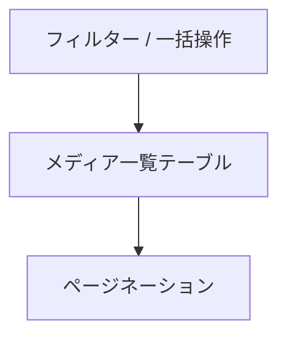

<!--
目的：「管理画面のレイアウト、各機能」の明文化
-->

# S2J MediaLibrary Date Corrector - 管理画面の UI 仕様

## 画面概要

本プラグインは、WordPress の「メディア > ライブラリ」一覧画面を拡張し、メディアの「日付 (post_date)」とファイルパス由来の年月との不整合を可視化・補正する機能を提供します。

既存の一覧テーブル (List View) に対して、以下を追加します。

* 補助カラム (年月 (パス) /差分)
* 一括操作 (Bulk Action)
* 行単位操作 (Row Action)
* 補助ボタン (差分抽出など)

本プラグインは既存 UI を拡張する形で実装し、標準操作との整合性を維持します。

## ナビゲーション (メニュー構成)

本プラグインは、操作画面と設定画面を分離した形で、WordPress 管理画面に対して、メニューを追加します。

### 追加メニュー構成

* メディア
  * ライブラリ (既存)
  * メディアファイルを追加 (既存)
  * …
  * **Media Date Corrector (本プラグイン)**

* 設定
  * 一般 (既存)
  * 投稿設定 (既存)
  * 表示設定 (既存)
  * …
  * **Media Date Corrector Settings (本プラグイン)**

### 差分確認・補正画面 (メディア配下)

「メディア > Media Date Corrector」は、差分確認および補正操作を行うための専用画面です。

本画面は、以下の役割を担います。

* メディアの `post_date` と、ファイルパス由来の年月の差分を可視化します。
* 選択的または一括で、補正処理を実行します。
* React ベースの UI により、高度な操作を提供します。

本画面の位置付けは、日常的な運用 (確認・補正作業) を行うための作業画面です。

### 設定画面 (設定配下)

「設定 > Media Date Corrector Settings」は、本プラグインの挙動を制御するための設定画面です。

本画面では、以下の設定を提供します。

* 差分カラム表示の有効/無効
* 一括での補正機能の有効/無効
* 補助機能 (差分のみ選択など) の有効/無効
* 将来的な拡張設定 (自動補正など)

設定は WordPress の option として保存されます。

### 設計方針

本プラグインは、以下の方針で画面を分離します。

* 操作 (補正処理) は「メディア」配下に配置します。
* 設定 (挙動制御) は「設定」配下に配置します。

これにより、WordPress 標準の UI 構造に準拠し、ユーザーの認知負荷を低減します。

## 既存機能との関係

本プラグインは、WordPress 標準のメディアライブラリ機能および他プラグインとの共存を前提とします。
特に、並び替え機能については、以下の方針とします。

* メディアの並び替えは、既存のメディアライブラリ画面に委ねます。
  * Intuitive Custom Post Order などのプラグインとの互換性を維持します。
* 本プラグインの専用画面では、並び替え機能は提供しません。

本プラグインは、あくまで「日付補正」に特化した UI を提供します。

## レイアウト構成

画面は、以下の構成です。

* 上部: フィルター / Bulk Actions
* 中央: メディア一覧テーブル
* 下部: ページネーション

補助操作は、Bulk Actions 周辺またはテーブル上部に配置します。

## 管理画面の登録設計

### メディア配下 (操作画面)

* 関数: `add_submenu_page`
* 親メニュー: `upload.php`
* スラッグ: `s2j-media-date-corrector`
* 役割: 差分確認・補正 UI

### 設定画面

* 関数: `add_options_page`
* 親メニュー: `options-general.php`
* スラッグ: `s2j-media-date-corrector-settings`
* 役割: 機能オン／オフ設定

### 設計方針

* 操作と設定を分離します。
* WordPress 標準のナビゲーションに準拠します。

## UI 状態 (State)

一覧拡張 UI は、次の状態を区別します。

* Idle
* Selecting
* Processing
* Completed
* Error

## スコープ

本画面における「スコープ」とは、補正処理の対象となるメディアの範囲を指します。
なお、「メディア」とは、REST API により取得したメディア一覧を指します。

### スコープの定義

補正対象は、以下のいずれかの単位で指定されます:

1. 個別選択 (Row 単位)
2. 複数選択 (チェックボックスによる選択)
3. 現在表示中の一覧 (フィルター結果)

### 非対象 (Out of Scope)

以下は、本画面のスコープ外です。

* ファイルの物理配置の変更
* `_wp_attached_file` の更新
* サムネイルやメタデータの再生成

### Bulk Action におけるスコープ

Bulk Action の挙動は、以下とします:

* Date Correct
  * 選択されたメディアのみが対象

* Date Correct (All)
  * (検索・フィルター条件を含む) 現在の一覧が対象

### 「All」の定義

本プラグインにおける「All」とは、以下を意味します:

* 現在画面に表示されている、検索結果の全件を指します。
* データベース上の全メディアではありません。

### フィルターとの関係

* スコープは、現在の検索・フィルター条件に依存します
* フィルターを変更した場合、スコープも動的に変化します

### 設計方針

* スコープは、ユーザーの操作結果にもとづいて決定します
* 意図しない全件更新を防ぐため、明示的な選択または確認を必須とします
* 冪等性 (べきとうせい) を前提とし、複数回実行しても結果が変わらない設計とします

## 操作制御

* 選択なしのときは、実行できません。
* 処理は、非同期 (REST API) で実行されます。
* 処理中は、操作できません。

## 一覧テーブル仕様

本画面の一覧テーブルは、WordPress 標準のメディアライブラリ (`WP_List_Table`) を拡張するものではなく、専用の React ベース UI として実装します。
状態は、コンポーネント内またはグローバルストアで管理します。

グリッド表示は、初期段階では対象外とし、将来的な対応を検討します。

### テーブルの位置付け

一覧テーブルは、以下の目的で使用します:

* メディアの `post_date` と、ファイルパス由来の年月の差分の可視化
* 補正対象のメディアの選択
* 一括または個別の補正操作の実行

### データ取得

一覧データは、REST API を通じて取得します。

取得対象:

* 添付ファイル (`post_type = attachment`)
* `_wp_attached_file` を含むメタ情報
* `post_date`

必要に応じて、ページネーション、検索、フィルター条件を指定可能とします。

### テーブル構成

本テーブルは、以下の構成を持ちます:

* ヘッダー (カラム名)
* ボディ (メディア一覧)
* フッター (ページネーション)

### 選択機能

* 各行に、チェックボックスを配置します
* ヘッダーに、「全選択」チェックボックスを配置します
* 選択状態は、UI 内部 (React state) で管理します

### ソートフィルター

初期段階では、以下をサポートします:

* ファイル名によるソート
* 日付 (`post_date`) によるソート

将来的に、以下について検討します。

* 差分 (MATCH/MISMATCH) によるフィルター
* 年月 (パス) によるフィルター

### 表示単位

* デフォルト表示件数は、20件です (将来的に変更可能)。
* ページネーションによる、分割表示をサポートします。

### state 設計

主な state は、下記の通りです:

* items - メディア一覧データ
* selectedIds - 選択された ID の集合 (Set)
* isAllSelected - 全選択状態
* loading - フラグ「データ取得中」
* processing - フラグ「補正処理中」
* pagination
  * page
  * perPage
  * total
* filters
  * search
  * diffOnly

### state 管理方針

* UI 状態は、React state で管理します。
* 選択状態は、Set<ID> で管理します。
* API 通信状態は、`loading`、`processing` で明示します。

### WordPress 標準 UI との関係

本テーブルは、WordPress 標準のメディア一覧とは独立した表示であり、既存の並び替え機能 (たとえば Intuitive Custom Post Order) とは連動しません。

## ページネーション仕様

本テーブルは、「サーバーサイド・ページネーション」を採用します。

### 基本仕様

* 方式: offset ベース
* パラメータ
  * page
  * per_page
  * total

### 理由

* WordPress REST API (`WP_Query`) との親和性が高い
* 実装が単純

### 将来的拡張

* 大量データ対応として、cursor ベースへの移行。

## 選択状態の永続化

選択状態は、ページを跨いでも維持されます。

### 実装方針

* selectedIds を、グローバル state または sessionStorage に保存します。
* ページ変更時も、状態を保持します。

### 全選択の扱い

* 全選択の対象は、現ページのみです。
* (誤操作の防止の観点で) 全件選択は、サポートしません。

### UX 方針

* 選択件数を、UI 上に表示します。
* 明示的な解除操作を、提供します。

## カラム定義

WordPress 標準の「メディア > ライブラリ」テーブルの既存カラムは、下記の通りです。

* ファイル (ただし、サムネイル画像付き)
* 投稿者
* アップロード先
* コメント
* 日付

React UI として表示される本テーブルにも、上記「既存カラム」の他に、論理カラムとして、下記を追加します。

* 年月 (パス)
* 差分
* 行操作

上記から、本テーブルの論理カラムとしての列定義は、下記のようになります。

* select - チェックボックス
* thumbnail - サムネイル
* filename - ファイル名
* post_date - 登録日
* path_date - 年月 (パス)
* diff - 差分
* actions - 行操作

### 年月 (パス)

* 内容: `_wp_attached_file` から抽出した `yyyy/mm`
* 表示例: `2017/12`

### 差分

* `post_date` の `yyyy/mm`
* 「年月 (パス)」の `yyyy/mm`

差分判定では、この両者を比較し、以下のロジックで行います。

* これらが一致する場合: MATCH - 正常を示します。
* 不一致の場合: MISMATCH - 補正対象を示します。

補足:

* 日 (dd) は、比較対象としません。
* 時刻も、無視します。

表示仕様:

* MATCH の場合は、通常表示 (または薄い色) とします。
* MISMATCH の場合は、強調表示 (赤系) とします。

ただし、WAI-ARIA の観点から、色だけで差分を提示してはなりません。

### 行操作

* 行単位での補正アクションを提供します。
* 例として、「Date Correct」という行アクションを設けます。

## 「WordPress メディア一覧」との連携 (選択引き継ぎ)

WordPress 標準のメディアライブラリ (List View) から、本プラグイン画面へ遷移する際、選択状態を引き継ぐことをサポートします。

### 引き継ぎ方法

以下のいずれかの方法を使用します:

* クエリーパラメータ (たとえば、`?ids=1,2,3`)
* セッションストレージ (`sessionStorage`)

### 挙動

* 遷移時に selectedIds を初期化します。
* 該当 ID が存在する場合は、自動的に選択状態にします。

### フォールバック

* 引き継ぎ情報がない場合は、通常の一覧を表示します。

## アクション (Bulk/Row)

### Bulk Action (一覧の一括操作)

本プラグインは、メディアライブラリの一覧画面に対して、日付補正のための一括操作を追加します。

#### Bulk Action に追加される項目

* 「Date Correct」: 選択した項目を補正する一括操作です。
* 「Date Correct (All)」: 一覧に表示されている対象の全件を補正する一括操作です。

※「Date Correct (All)」は、確認ダイアログを経由して実行される想定です。

#### 「Date Correct (All)」の適用範囲

「All」は、次のいずれかの挙動になり得ます。

* 現在のフィルター結果に対して全件適用する方式 (推奨)。
* 全メディアに対して適用する方式 (非推奨・要確認)。

本プラグインでは、以下を採用します。

* 現在の一覧 (検索・フィルター結果) を対象とします。

理由:

* WordPress 標準の挙動に準拠します。
* 意図しない全件更新を防止します。

### Row Action

個別補正は、以下の用途を想定します。

* 個別確認後のピンポイント修正
* Bulk 対象外データの補正

UI 上は、既存の「編集」「削除」と同列に表示します。

### ボタン配置

Bulk Action は、WordPress 標準の UI に準拠し、以下の位置に配置されます。

```text
[Bulk Actions ▼] [適用]
```

また、補助的に、以下の専用ボタンを配置することも検討します。

```text
[差分のみ選択] [補正実行]
```

### 実行中の UI 状態

補正処理の実行時は、以下により「状態の可視化」を提示します。

* ローディングインジケータの表示
* (多重実行の防止の観点により) 操作ボタンの無効化
* 対象件数を表示します (たとえば、「10件を処理中」)

大量件数の場合:

* (任意) プログレス表示が可能です。
* 非同期処理を前提とします。

完了後は、次のとおりです。

* 成功メッセージを表示します。
* 一覧を再描画します。

### エラーハンドリング

補正処理中にエラーが発生した場合は、次のとおりです。

* エラーメッセージを通知します。
* (可能であれば) 処理済み/未処理件数を表示します。

想定エラーは、次のとおりです。

* 権限不足です。
* REST API エラーです。
* データ不整合 (パス取得不可) です。

UI の挙動は、次のとおりです。

* 処理を中断またはスキップします。
* 再実行可能な状態を維持します。

## 操作フロー

処理結果は、非同期で反映されます。

### 基本フロー

本プラグインにおける、基本的な操作の流れは、以下の通りです。

1. メディア一覧を表示します。
2. 「差分」列を確認します。
3. 対象メディアを選択します。
4. Bulk Action または行アクションを選択します。
5. 補正処理を実行します。
6. 結果を確認します。

### 差分ベース操作

1. 「差分のみ選択」ボタンをクリックします。
2. MISMATCH のみ自動選択します。
3. Bulk Action を実行します。

### 状態遷移

補正処理は「UI 状態 (State)」の各状態をたどります。
UI は、状態に応じて表示を切り替えます。

## React 画面のマウントポイント

React UI は、管理画面内の専用コンテナにマウントします。

### マウント要素

```html
<div id="s2j-media-date-corrector-root"></div>
```

### 初期化

* `admin_enqueue_scripts` にて、スクリプトをロードします。
* `DOMContentLoaded` 後に、マウントします。

### WordPress 連携

* `@wordpress/element` を使用します。
* REST API エンドポイントは、`wpApiSettings` を利用します。

### データ受け渡し

* 初期設定は `wp_localize_script` で注入します。

## ワイヤーフレーム

本ワイヤーフレームは、専用 React 画面の構成を示します。

### 1. 一覧テーブル



### 2. テーブル列構成

```text
[ ] | サムネイル | ファイル名 | 日付(post_date) | 年月(パス) | 差分 | 操作
```

### 3. アクション配置

```text
[Bulk Actions ▼] [適用]
[補正実行ボタン]
```
