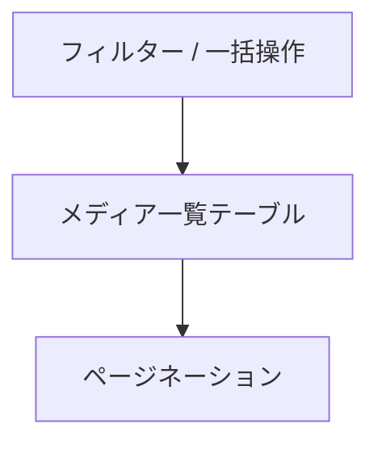

<!--
目的：「管理画面のレイアウト、各機能」の明文化
-->

# S2J MediaLibrary Date Corrector - 管理画面の UI 仕様

## 画面概要

## 一覧テーブル仕様

## カラム定義

## アクション（Bulk / Row）

## 操作フロー

## ワイヤーフレーム

### 1. 一覧テーブル


### 2. テーブル列構成

```text
[ ] | サムネイル | ファイル名 | 日付(post_date) | 年月(パス) | 差分 | 操作
```

### 3. アクション配置

```text
[Bulk Actions ▼] [適用]
[補正実行ボタン]
```
