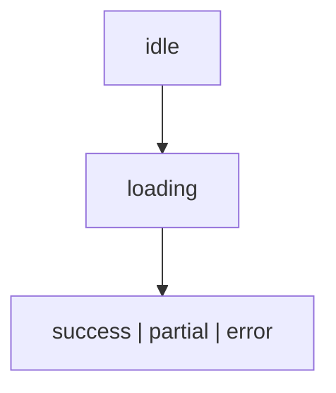
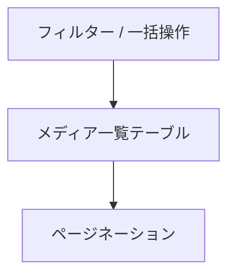

<!--
目的：「管理画面のレイアウト、各機能」の明文化
-->

# S2J MediaLibrary Date Corrector - 管理画面の UI 仕様

## 画面概要

本プラグインは、WordPress の「メディア > ライブラリ」一覧画面を拡張し、メディアの「日付 (post_date)」とファイルパス由来の年月との不整合を可視化・補正する機能を提供します。

既存の一覧テーブル (List View) に対して、以下を追加します。

* 補助カラム (年月 (パス) /差分)
* 一括操作 (Bulk Action)
* 行単位操作 (Row Action)
* 補助ボタン (差分抽出など)

本プラグインは既存 UI を拡張する形で実装し、標準操作との整合性を維持します。

## ナビゲーション (メニュー構成)

本プラグインは、操作画面と設定画面を分離した形で、WordPress 管理画面に対して、メニューを追加します。

### 追加メニュー構成

* メディア
  * ライブラリ (既存)
  * メディアファイルを追加 (既存)
  * …
  * **Media Date Corrector (本プラグイン)**

* 設定
  * 一般 (既存)
  * 投稿設定 (既存)
  * 表示設定 (既存)
  * …
  * **Media Date Corrector Settings (本プラグイン)**

### 差分確認・補正画面 (メディア配下)

「メディア > Media Date Corrector」は、差分確認および補正操作を行うための専用画面です。

本画面は、以下の役割を担います。

* メディアの `post_date` と、ファイルパス由来の年月の差分を可視化します。
* 選択的または一括で、補正処理を実行します。
* React ベースの UI により、高度な操作を提供します。

本画面の位置付けは、日常的な運用 (確認・補正作業) を行うための作業画面です。

### 設定画面 (設定配下)

「設定 > Media Date Corrector Settings」は、本プラグインの挙動を制御するための設定画面です。

本画面では、以下の設定を提供します。

* 差分カラム表示の有効/無効
* 一括での補正機能の有効/無効
* 補助機能 (差分のみ選択など) の有効/無効
* 将来的な拡張設定 (自動補正など)

設定は WordPress の option として保存されます。

### 設計方針

本プラグインは、以下の方針で画面を分離します。

* 操作 (補正処理) は「メディア」配下に配置します。
* 設定 (挙動制御) は「設定」配下に配置します。

これにより、WordPress 標準の UI 構造に準拠し、ユーザーの認知負荷を低減します。

本仕様書では、「ユーザーに見える振る舞い (What)」のみを定義し、実装手段 (How) は定義しません。

### 本仕様書の対象 - What

本仕様書では、以下を定義対象とします。

* 画面構成
* 表示内容 (カラム、メッセージ)
* 操作 (Bulk Action、Row Action)
* 状態遷移 (UI 状態)
* スコープ (対象範囲の定義)

### 本仕様書で扱わないもの - How

以下は、本仕様書では扱いません。

* API コール方法 (`api-fetch` 等)
* state 管理の実装手法 (useState / useReducer 等)
* データ取得の具体手段
* エラーハンドリングの実装詳細
* ミドルウェア構成

これらは、[アーキテクチャー](./architecture.md) にて定義します。

### 設計意図

* UI 仕様を、実装技術から独立させます。
* 実装変更 (React 構成変更など) の影響を最小化します。
* デザイナー/仕様策定者と、実装者の関心を分離します。

## 既存機能との関係

本プラグインは、WordPress 標準のメディアライブラリ機能および他プラグインとの共存を前提とします。
特に、並び替え機能については、以下の方針とします。

* メディアの並び替えは、既存のメディアライブラリ画面に委ねます。
  * Intuitive Custom Post Order などのプラグインとの互換性を維持します。
* 本プラグインの専用画面では、並び替え機能は提供しません。

本プラグインは、あくまで「日付補正」に特化した UI を提供します。

## レイアウト構成

画面は、以下の構成です。

* 上部: フィルターおよび Bulk Actions
* 中央: メディア一覧テーブル
* 下部: ページネーション

補助操作は、Bulk Actions 周辺またはテーブル上部に配置します。

## 一覧テーブルの設計方針

本画面の一覧テーブルは、WordPress 標準の「メディア > ライブラリ」画面のカラム構成および概念モデルを踏襲しつつ、専用の React ベース UI として再構成します。

### 設計の位置付け

本テーブルは、次の性質を持ちます。

* WordPress 標準のメディア一覧 `WP_List_Table` を、**直接拡張するものではありません**。
* 標準 UI とは独立した、専用の管理画面として実装します。
* データモデルおよびカラム構成は、標準ライブラリと互換性があります。

### カラム構成の方針

以下の2種類のカラムで構成します。

#### 標準カラム (踏襲)

* サムネイル
* ファイル名
* 日付 (`post_date`)

これらは、WordPress のメディアライブラリと同等の意味・表示を持ちます。

#### 拡張カラム (本プラグイン独自)

* 年月 (パス由来)
* 差分 (MATCH/MISMATCH)
* ステータス
* 操作 (補正)

### UI 構造の特徴

* 見た目および操作感は、WordPress 標準の一覧テーブルに近付けます。
* ただし、実装は React による独自テーブルとします。
* WordPress の jQuery や `WP_List_Table` には依存しません。

### 既存ライブラリ画面との関係

* 両者は、データ的には同一の attachment 投稿を扱います。
* 表示および操作は、独立しています。
* 並び替え (例: Intuitive Custom Post Order) は、標準画面側で行います。

### 設計意図

* ユーザーにとっての学習コストを、最小化します (見慣れた構造)。
* React による柔軟な UI 制御を、可能にします。
* WordPress 標準 UI との衝突を、回避します。

## 管理画面の登録設計

### メディア配下 (操作画面)

* 関数: `add_submenu_page`
* 親メニュー: `upload.php`
* スラッグ: `s2j-media-date-corrector`
* 役割: 差分確認・補正 UI

### 設定画面

* 関数: `add_options_page`
* 親メニュー: `options-general.php`
* スラッグ: `s2j-media-date-corrector-settings`
* 役割: 機能のオン／オフ設定

### 設計方針

* 操作と設定を分離します。
* WordPress 標準のナビゲーションに準拠します。

## UI 状態 (State)

本画面の状態は、REST API のレスポンス `status` と一致する形で定義します。

### 状態一覧

| 状態 | 説明 |
| ------- | ------------------ |
| idle | 初期状態 (未実行) |
| loading | 処理実行中 |
| success | 全件成功 |
| partial | 一部成功 (失敗またはスキップを含む) |
| error | 全体失敗 |

### 状態遷移



### REST API との対応

| UI 状態 | REST status |
| ------- | ----------- |
| success | success |
| partial | partial |
| error | error |

### 設計方針

* UI 状態は、REST API の `status` と「1対1」に対応させます。
* 中間的な抽象状態 (`completed` 等) は持ちません。
* 状態は、単一の state machine として扱います。

## UI メッセージ

本プラグインは、処理状態および結果に応じて、ユーザーに対して適切なフィードバックメッセージを表示します。

UI メッセージは、「UI 状態 (State)」および REST API のレスポンス (`status`、`summary`) にもとづいて決定されます。

### 状態別メッセージ

#### 状態とメッセージの対応

UI メッセージは、「UI 状態 (State)」と REST API の `status` にもとづいて決定します。
これにより、状態と表示の一貫性を保証します。

#### Idle

* 「対象を選択してください」
* 「差分を確認してください」

#### Processing (処理中)

* 「{count} 件を処理中です…」
  * この時、操作は一時的に無効化されます。

#### Success (全件成功)

* 「{count} 件の補正が完了しました」

#### Partial (一部成功)

* 「{success} 件成功、{failed} 件失敗、{skipped} 件スキップされました」

#### Error (全体失敗)

* 「処理に失敗しました」
* 「権限不足、またはシステムエラーの可能性があります」

### 詳細メッセージ (件別)

必要に応じて、`results` にもとづき、個別エラーを表示可能とします。

* `permission_denied`:
  * 「権限がありません」
* `attachment_not_found`:
  * 「対象が存在しません」
* `processing_error`:
  * 「処理中にエラーが発生しました」

### 再試行 (リトライ) 誘導

本画面では、処理結果にもとづき、ユーザーに再試行 (リトライ) を促します。

#### 表示条件

* `summary.failed > 0` の場合:
  * 「失敗した {failed} 件を再試行できます」と表示します。
* `processed < total` の場合:
  * 「一部未処理の項目があります」と表示します。

#### 操作

* 「Retry Failed」ボタンを表示します。
* ボタン押下時、対象 ID を再送信します。

#### リトライ仕様

リトライ対象および挙動の詳細は、REST API 仕様に従います。

* 参照: [REST API 仕様 > リトライ仕様 (統一定義)](./rest_api_spec.md#リトライ仕様-統一定義)

### 表示方針

* メッセージは、状態に応じて自動的に切り替えます。
* 成功/警告/エラーを、視覚的に区別します (色・アイコン)。
* (WAI-ARIA アクセシビリティの観点で) 色だけでなくテキストでも、状態を明示します。


### 未処理要素の扱い - UI による推定

本画面では、未処理要素 `not_processed` を REST API から直接は受け取りません。
`summary` の差分から推定します。

#### 判定方法

以下の式により、未処理件数を算出します。

```text
unprocessed = total - processed
```

#### 表示条件

* `unprocessed > 0` の場合:
  * 「一部未処理の項目があります」と表示します。

#### UI 挙動

* 未処理要素は、一覧テーブルには表示しません。
* summary にもとづく警告メッセージのみ、表示します。

### 設計方針

* API レスポンスを、最小限に保ちます。
* REST API の `summary` を主に参照し、UI を構築します。
* `results` は、詳細表示およびデバッグ用途とします。
* メッセージは、簡潔かつ行動指針 (次に何をすべきか) を含めます。
* UI は、派生情報を計算して表示します。
* 未処理の詳細は、必要に応じて、再取得または再試行で対応します。

### UI メッセージの国際化 (i18n、gettext 設計)

本プラグインの UI メッセージは、WordPress の国際化機構 (gettext) に準拠して実装します。

#### 基本方針

* すべてのユーザー向け文字列は、翻訳可能とします。
* ハードコードされた文字列は、使用しません。
* text domain は、`s2j-media-library-date-corrector` を使用します。

#### 実装方法

React コンポーネントでは、以下を使用します。

```ts
import { __, sprintf } from '@wordpress/i18n';

__('処理に失敗しました', 's2j-media-library-date-corrector');

sprintf(
  __('%d 件を処理中です…', 's2j-media-library-date-corrector'),
  count
);
```

#### プレースホルダ

動的メッセージは、`sprintf` を用いて組み立てます。

* `{count}` → `%d`
* `{success}` → `%d`

#### 翻訳対象

翻訳対象は、次のとおりです。

* 状態メッセージ
* エラーメッセージ
* ボタンラベル (例: `Retry`)
* 補助テキスト

#### 設計方針

* UI メッセージは、「キー」ではなく「文」で管理します。
* REST API のエラーコードは、gettext による翻訳対象に含めません。表示文言は、UI 側のマッピングで決めます。
* 将来的な多言語対応を前提とします。

### UI メッセージのコンポーネント設計 (Notification、Toast、Inline)

UI メッセージは、用途に応じて表示コンポーネントを分離します。

#### コンポーネント分類

##### Notification (常設メッセージ)

* 画面上部に表示します。
* 状態のサマリーを表示します (success / partial / error)。
* 例:
  * 「10件中8件成功、2件失敗」

##### Toast (短時間表示)

* 一時的に表示される通知です。
* 操作結果のフィードバックに使用します。
* 例:
  * 「補正が完了しました」

##### Inline (行内表示)

* テーブル行または要素内に表示します。
* 個別エラーや状態を表示します。
* 例:
  * 「権限がありません」

#### 使い分け

| 状況 | コンポーネント |
| --------- | ------------ |
| 一括処理の結果 | Notification |
| 即時フィードバック | Toast |
| 個別エラー | Inline |

#### 設計方針

* 表示粒度に応じて、コンポーネントを分離します。
* 同一情報を、複数ヵ所に重複表示しません。
* ユーザーの視線移動を、最小化します。

#### 実装方針

* 共通の Message コンポーネントを基底とします。
* 状態 (success / warning / error) を props で制御します。
* WAI-ARIA (`role="alert"` 等) に対応します。

## スコープ

本画面における「スコープ」とは、補正処理の対象となるメディアの範囲を指します。
なお、「メディア」とは、REST API により取得したメディア一覧を指します。

### スコープの定義

補正対象は、以下のいずれかの単位で指定されます。

1. 個別選択 - Row 単位
2. 複数選択 - チェックボックスによる選択
3. 現在表示中の一覧 - フィルター結果

### 非対象 (Out of Scope)

以下は、本画面のスコープ外です。

* ファイルの物理配置の変更
* `_wp_attached_file` の更新
* サムネイルやメタデータの再生成

### Bulk Action におけるスコープ

Bulk Action の挙動は、以下のとおりです。

* Date Correct
  * 選択されたメディアのみが対象です。

* Date Correct (All)
  * (検索・フィルター条件を含む) 現在の一覧が対象です。

### 「All」の定義

本プラグインにおける「All」とは、以下を意味します。

* 現在の検索・フィルター条件に一致する **全件** を指します。
* 表示中のページに限定されません (ページ非依存)。
* データベース上の全メディアではありません。

#### ページネーションとの関係

* ページネーションは、表示上の分割に過ぎません。
* 「All」は、ページを跨いだ全件を対象とします。

#### 選択状態との関係

* 個別選択 (チェックボックス) は、ページ単位で管理されます。
* 「Date Correct (All)」は、選択状態にかかわらず、現在のフィルター結果全体に対して適用されます。

#### 設計方針

* ユーザーの認知モデルを、「検索結果 = 対象範囲」と一致させます。
* ページ単位の誤解による、部分更新を防止します。
* WordPress 標準の Bulk 操作の挙動と整合させます。

### フィルターとの関係

* スコープは、現在の検索・フィルター条件に依存します。
* フィルターを変更した場合、スコープも動的に変化します。

### 設計方針

* スコープは、ユーザーの操作結果にもとづいて決定します。
* 意図しない全件更新を防ぐため、明示的な選択または確認を必須とします。
* 冪等性（べきとうせい）を前提に、複数回実行しても結果が変わらないよう設計します。

## 操作制御

* 選択なしのときは、実行できません。
* 処理は、非同期 (REST API) で実行されます。
* 処理中は、操作できません。

## 一覧テーブル仕様

本画面の一覧テーブルは、WordPress 標準のメディアライブラリ (`WP_List_Table`) を拡張するものではなく、専用の React ベース UI として実装します。
状態は、コンポーネント内またはグローバルストアで管理します。

グリッド表示は、初期段階では対象外です。
将来的な対応を検討します。

### テーブルの位置付け

一覧テーブルは、以下の目的で使用します。

* メディアの `post_date` と、ファイルパス由来の年月の差分の可視化
* 補正対象のメディアの選択
* 一括または個別の補正操作の実行

### データ取得

一覧データは、REST API を通じて取得します。

取得対象は、次のとおりです。

* 添付ファイル (`post_type = attachment`)
* `_wp_attached_file` を含むメタ情報
* `post_date`

必要に応じて、ページネーション、検索、フィルター条件を指定可能とします。

### テーブル構成

本テーブルは、以下の構成を持ちます。

* ヘッダー (カラム名)
* ボディ (メディア一覧)
* フッター (ページネーション)

### 選択機能

* 各行に、チェックボックスを配置します。
* ヘッダーに、「全選択」チェックボックスを配置します。
* 選択状態は、UI 内部 (React state) で管理します。

### ソートフィルター

初期段階では、以下をサポートします。

* ファイル名によるソート
* 日付 (`post_date`) によるソート

将来的に、以下のフィルター追加などを検討します。

* 差分 (MATCH/MISMATCH) によるフィルター
* 年月 (パス) によるフィルター

### 表示単位

* デフォルト表示件数は、20件です (将来的に変更可能)。
* ページネーションによる、分割表示をサポートします。

### state 設計

主な state は、下記の通りです。

* items - メディア一覧データ
* selectedIds - 選択された ID の集合 (Set)
* isAllSelected - 全選択状態
* loading - フラグ「データ取得中」
* processing - フラグ「補正処理中」
* pagination
  * page
  * perPage
  * total
* filters
  * search
  * diffOnly

### state 管理方針

* UI 状態は、React state で管理します。
* 選択状態は、Set<ID> で管理します。
* API 通信状態は、`loading`、`processing` で明示します。

### WordPress 標準 UI との関係

本テーブルは、WordPress 標準のメディア一覧とは独立した表示であり、既存の並び替え機能 (たとえば Intuitive Custom Post Order) とは連動しません。

## ページネーション仕様

本テーブルは、「サーバーサイド・ページネーション」を採用します。

### 基本仕様

* 方式は、offset ベースです。
* パラメータは、次のとおりです。
  * page — ページ番号です。
  * per_page — 1 ページあたりの件数です。
  * total — 総件数です。

### 理由

* WordPress REST API (`WP_Query`) との親和性が高い
* 実装が単純

### 将来的拡張

* 大量データ対応として、cursor ベースへの移行。

## 選択状態の永続化

選択状態は、ページを跨いでも維持されます。

### 実装方針

* selectedIds を、グローバル state または sessionStorage に保存します。
* ページ変更時も、状態を保持します。

#### 実現方法 (参考)

* グローバル state を用います。
* ストレージ (例: sessionStorage) を用います。

※ 実装手段は、[アーキテクチャー](./architecture.md) に従います。

### 全選択の扱い

* 全選択の対象は、現ページのみです。
* (誤操作の防止の観点で) 全件選択は、サポートしません。

### UX 方針

* 選択件数を、UI 上に表示します。
* 明示的な解除操作を、提供します。

## カラム定義

WordPress 標準の「メディア > ライブラリ」テーブルの既存カラムは、下記の通りです。

* ファイル (ただし、サムネイル画像付き)
* 投稿者
* アップロード先
* コメント
* 日付

React UI として表示される本テーブルにも、上記「既存カラム」の他に、論理カラムとして、下記を追加します。

* 年月 (パス)
* 差分
* 行操作

上記から、本テーブルの論理カラムとしての列定義は、下記のようになります。

* select - チェックボックス
* thumbnail - サムネイル
* filename - ファイル名
* post_date - 登録日
* path_date - 年月 (パス)
* diff - 差分
* actions - 行操作

### 年月 (パス)

* 内容: `_wp_attached_file` から抽出した `yyyy/mm`
* 表示例: `2017/12`

### 差分

* `post_date` の `yyyy/mm`
* 「年月 (パス)」の `yyyy/mm`

差分判定では、この両者を比較し、以下のロジックで行います。

* 一致する場合は MATCH と判定し、正常を示します。
* 不一致の場合は MISMATCH と判定し、補正対象を示します。

補足は、次のとおりです。

* 日 (dd) は、比較対象としません。
* 時刻も、無視します。

表示仕様は、次のとおりです。

* MATCH の場合は、通常表示 (または薄い色) とします。
* MISMATCH の場合は、強調表示 (赤系) とします。

ただし、WAI-ARIA の観点から、色だけで差分を提示してはなりません。

### 行操作

* 行単位での補正アクションを提供します。
* 例として、「Date Correct」という行アクションを設けます。

## 「WordPress メディア一覧」との連携 (選択引き継ぎ)

WordPress 標準のメディアライブラリ (List View) から、本プラグイン画面へ遷移する際、選択状態を引き継ぐことをサポートします。

### 引き継ぎ方法

引き継ぎに、以下のいずれかの方法を用います。

* クエリーパラメータ (たとえば、`?ids=1,2,3`)
* セッションストレージ (`sessionStorage`)

### 挙動

* 遷移時に selectedIds を初期化します。
* 該当 ID が存在する場合は、自動的に選択状態にします。

### フォールバック

* 引き継ぎ情報がない場合は、通常の一覧を表示します。

## アクション (Bulk/Row)

### Bulk Action (一覧の一括操作)

本プラグインは、メディアライブラリの一覧画面に対して、日付補正のための一括操作を追加します。

#### Bulk Action に追加される項目

* 「Date Correct」: 選択した項目を補正する一括操作です。
* 「Date Correct (All)」: 一覧に表示されている対象の全件を補正する一括操作です。

※「Date Correct (All)」は、確認ダイアログを経由して実行される想定です。

#### 「Date Correct (All)」の適用範囲

「All」として想定できる挙動は、次のとおりです。

* 現在のフィルター結果に対して全件適用する方式 (推奨)。
* 全メディアに対して適用する方式 (非推奨・要確認)。

本プラグインでは、以下を採用します。

* 現在の一覧 (検索・フィルター結果) を対象とします。

理由:

* WordPress 標準の挙動に準拠します。
* 意図しない全件更新を防止します。

### Row Action

個別補正は、次の用途を想定します。

* 個別確認後のピンポイント修正
* Bulk 対象外データの補正

UI 上は、既存の「編集」「削除」と同列に表示します。

### ボタン配置

Bulk Action は、WordPress 標準の UI に準拠し、以下の位置に配置されます。

```text
[Bulk Actions ▼] [適用]
```

また、補助的に、以下の専用ボタンを配置することも検討します。

```text
[差分のみ選択] [補正実行]
```

### 実行中の UI 状態

補正処理の実行時は、以下により「状態の可視化」を提示します。

* ローディングインジケータの表示
* (多重実行の防止の観点により) 操作ボタンの無効化
* 対象件数 (たとえば、「10件を処理中」) の表示

大量件数の場合は、次のとおりです。

* (任意) プログレス表示が可能です。
* 非同期処理を前提とします。

完了後は、次のとおりです。

* 成功メッセージを表示します。
* 一覧を再描画します。

### エラーハンドリング

補正処理中にエラーが発生した場合は、次のとおりです。

* エラーメッセージを通知します。
* (可能であれば) 処理済み/未処理件数を表示します。

想定エラーは、次のとおりです。

* 権限不足です。
* REST API エラーです。
* データ不整合 (パス取得不可) です。

UI の挙動は、次のとおりです。

* 処理を中断またはスキップします。
* 再実行可能な状態を維持します。

## 操作フロー

処理結果は、非同期で反映されます。

### 基本フロー

本プラグインにおける、基本的な操作の流れは、以下の通りです。

1. メディア一覧を表示します。
2. 「差分」列を確認します。
3. 対象メディアを選択します。
4. Bulk Action または行アクションを選択します。
5. 補正処理を実行します。
6. 結果を確認します。

### 差分ベース操作

1. 「差分のみ選択」ボタンをクリックします。
2. MISMATCH のみ自動選択します。
3. Bulk Action を実行します。

### 状態遷移

補正処理は「UI 状態 (State)」の各状態をたどります。
UI は、状態に応じて表示を切り替えます。

## React 画面のマウントポイント

React UI は、管理画面内の専用コンテナにマウントします。

### マウント要素

```html
<div id="s2j-media-date-corrector-root"></div>
```

### 初期化

* `admin_enqueue_scripts` にて、スクリプトをロードします。
* `DOMContentLoaded` 後に、マウントします。

### WordPress 連携

* `@wordpress/element` を使用します。
* REST API エンドポイントは、`wpApiSettings` を利用します。

### データ受け渡し

* 初期設定は `wp_localize_script` で注入します。

## ワイヤーフレーム

本ワイヤーフレームは、専用 React 画面の構成を示します。

### 一覧テーブル



### テーブル列構成

```text
[ ] | サムネイル | ファイル名 | 日付(post_date) | 年月(パス) | 差分 | 操作
```

### アクション配置

```text
[Bulk Actions ▼] [適用]
[補正実行ボタン]
```
