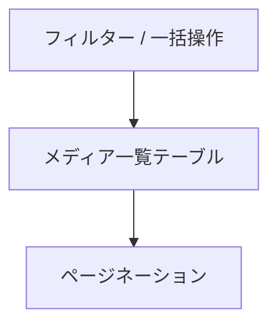

<!--
目的：「管理画面のレイアウト、各機能」の明文化
-->

# S2J MediaLibrary Date Corrector - 管理画面の UI 仕様

## 画面概要

本プラグインは、WordPress の「メディア > ライブラリ」一覧画面を拡張し、メディアの「日付 (post_date)」とファイルパス由来の年月との不整合を可視化・補正する機能を提供します。

既存の一覧テーブル (List View) に対して、以下を追加します。

* 補助カラム (年月 (パス) /差分)
* 一括操作 (Bulk Action)
* 行単位操作 (Row Action)
* 補助ボタン (差分抽出など)

本プラグインは既存 UI を拡張する形で実装し、標準操作との整合性を維持します。

## ナビゲーション (画面遷移)

本プラグインは、WordPress 管理画面の「メディア」メニュー配下に、独自のサブメニューを追加します。
また、WordPress 管理画面の「設定」メニュー配下に、独自のサブメニューも追加します。

### 追加されるメニュー

* メディア
  * ライブラリ (既存)
  * メディアファイルを追加 (既存)
  * …
  * **Media Date Corrector (本プラグイン)**
* 設定
  * 一般
  * 投稿設定
  * …
  * **S2J Media Library Date Corrector (本プラグイン)**

---

### 画面の位置付け

「設定」画面では、「◯◯機能」サポートの有効化/無効化といったコントロールを担います。

「Media Date Corrector」画面では、下記の「差分確認、補正操作」を担い、既存の「ライブラリ」画面とは独立した、専用画面として提供します。

* 「メディア一覧」の拡張ビューです。
* 差分確認および補正操作の専用 UI です。

### ライブラリ画面との関係

* 専用サブ画面として提供します。
* 高機能 UI (React ベース) を実装可能です。

---

### 遷移フロー

* 「メディア > S2J Date Corrector」をクリックします。
* 専用 UI (React) を表示します。
* REST API を介してデータを取得・更新します。

---

## 既存機能との関係

本プラグインは、WordPress 標準のメディアライブラリ機能および他プラグインとの共存を前提とします。
特に、並び替え機能については、以下の方針とします。

* メディアの並び替えは、既存のメディアライブラリ画面に委ねます。
  * Intuitive Custom Post Order などのプラグインとの互換性を維持します。
* 本プラグインの専用画面では、並び替え機能は提供しません。

本プラグインは、あくまで「日付補正」に特化した UI を提供します。

## レイアウト構成

画面は、以下の構成です。

* 上部: フィルター / Bulk Actions
* 中央: メディア一覧テーブル
* 下部: ページネーション

補助操作は、Bulk Actions 周辺またはテーブル上部に配置します。

## UI 状態 (State)

一覧拡張 UI は、次の状態を区別します。

* Idle
* Selecting
* Processing
* Completed
* Error

## スコープ

### Date Correct (All)

* 現在のフィルター結果に適用します。

(「現在の一覧」=検索・年月フィルター等を反映した表示中の結果です。サイト全体の全メディア一括は対象外です。詳細は [アクション (Bulk/Row)](#アクション-bulk--row) の『「Date Correct (All)」の適用範囲』を参照してください)

## 操作制御

* 選択なしのときは、実行できません。
* 処理中は、操作できません。

## 一覧テーブル仕様

対象は、「リスト表示 (List View)」です。

グリッド表示は、初期段階では対象外とし、将来的な対応を検討します。

テーブルは WordPress 標準の `WP_List_Table` 構造に準拠し、既存カラムに加えて拡張カラムを追加します。

## カラム定義

追加カラムは、以下の通りです。

### 年月 (パス)

* 内容: `_wp_attached_file` から抽出した `yyyy/mm`
* 表示例: 2017/12

### 差分

差分判定は、以下のロジックで行います。

* `post_date` の `yyyy/mm`
* 「年月 (パス)」の `yyyy/mm`

この両者を比較し、これらが一致する場合: MATCH - 正常を示します。
不一致の場合: MISMATCH - 補正対象を示します。

補足:

* 日 (dd) は比較対象としません。
* 時刻も無視します。

表示仕様:

* MATCH の場合は、通常表示 (または薄い色) とします。
* MISMATCH の場合は、強調表示 (赤系) とします。

ただし、WAI-ARIA の観点から、色だけで差分を提示してはなりません。

### 操作

* 行単位での補正アクションを提供します。
* 例として、Date Correct という行アクションを設けます。

## アクション (Bulk/Row)

### Bulk Action (一覧の一括操作)

本プラグインは、メディアライブラリの一覧画面に対して、日付補正のための一括操作を追加します。

#### Bulk Actions に追加される項目

* 「Date Correct」: 選択した項目を補正する一括操作です。
* 「Date Correct (All)」: 一覧に表示されている対象の全件を補正する一括操作です。

※「Date Correct (All)」は、確認ダイアログを経由して実行される想定です。

#### 「Date Correct (All)」の適用範囲

「All」は、次のいずれかの挙動になり得ます。

* 現在のフィルター結果に対して全件適用する方式 (推奨)。
* 全メディアに対して適用する方式 (非推奨・要確認)。

本プラグインでは、以下を採用します。

* 現在の一覧 (検索・フィルター結果) を対象とします。

理由:

* WordPress 標準の挙動に準拠します。
* 意図しない全件更新を防止します。

### Row Action

単体補正は、以下の用途を想定します。

* 個別確認後のピンポイント修正
* Bulk 対象外データの補正

UI 上は、既存の「編集」「削除」と同列に表示します。

### ボタン配置

Bulk Action は、WordPress 標準の UI に準拠し、以下の位置に配置されます。

```text
[Bulk Actions ▼] [適用]
```

また、補助的に以下の専用ボタンを配置することも検討します。

```text
[差分のみ選択] [補正実行]
```

### 実行中の UI 状態

補正処理の実行時は、以下の状態を表示します。

* ローディングインジケータ表示
* 操作ボタンの無効化 (多重実行の防止)
* 対象件数の表示 (たとえば、「10件を処理中」)

大量件数の場合:

* (任意) プログレス表示が可能です。
* 非同期処理を前提とします。

完了後は、次のとおりです。

* 成功メッセージを表示します。
* 一覧を再描画します。

### エラーハンドリング

補正処理中にエラーが発生した場合は、次のとおりです。

* エラーメッセージを通知します。
* (可能であれば) 処理済み/未処理件数を表示します。

想定エラーは、次のとおりです。

* 権限不足です。
* REST API エラーです。
* データ不整合 (パス取得不可) です。

UI の挙動は、次のとおりです。

* 処理を中断またはスキップします。
* 再実行可能な状態を維持します。

## 操作フロー

### 基本フロー

本プラグインにおける、基本的な操作の流れは、以下の通りです。

1. メディア一覧を表示します。
2. 「差分」列を確認します。
3. 対象メディアを選択します。
4. Bulk Action または行アクションを選択します。
5. 補正処理を実行します。
6. 結果を確認します。

### 差分ベース操作

1. 「差分のみ選択」ボタンをクリックします。
2. MISMATCH のみ自動選択します。
3. Bulk Action を実行します。

### 状態遷移

補正処理は「UI 状態 (State)」の各状態をたどります。UI は状態に応じて表示を切り替えます。

## ワイヤーフレーム

### 1. 一覧テーブル


### 2. テーブル列構成

```text
[ ] | サムネイル | ファイル名 | 日付(post_date) | 年月(パス) | 差分 | 操作
```

### 3. アクション配置

```text
[Bulk Actions ▼] [適用]
[補正実行ボタン]
```
