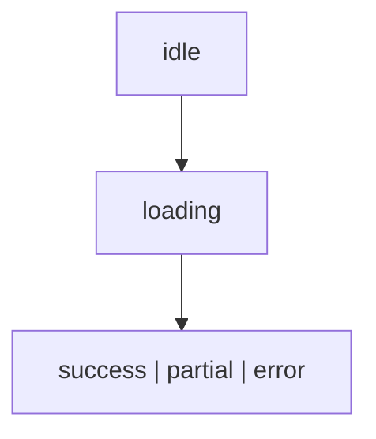
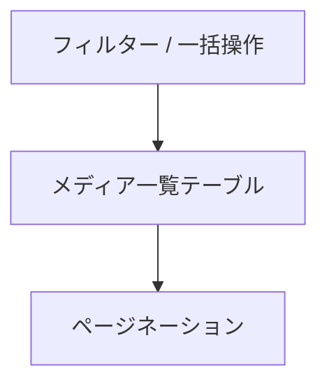

<!--
目的：「管理画面のレイアウト、各機能」の明文化
-->

# S2J MediaLibrary Date Corrector - 管理画面の UI 仕様

## 画面概要

本プラグインは、WordPress の「メディア > ライブラリ」一覧画面を拡張し、メディアの「日付 (`post_date`)」とファイルパス由来の年月との不整合を可視化・補正する機能を提供します。

既存の一覧テーブル (List View) に対して、下記を追加します。

* 列は「年月 (パス)」と「差分」です。差分は、その列の文字 (一致、不一致、不明) で見ます。
* 一括操作は Date Correct です。チェックした ID だけを `/attachments/correct` に送ります。
* 行アクションは Date Correct です。チェックは不要で、その行の ID を `/attachments/correct` に送ります。
* 一括メニューの外に、Date Correct (All) を1つ置きます。確認のあと、いまの検索とフィルターを `/attachments/correct-query` に送ります。

差分の表示は、PHP の列が行います。一覧の GET も、プレビュー用のルートも作りません。コアの一覧に足すボタンは、Date Correct (All) だけです。

本プラグインは既存 UI を拡張する形で実装し、標準操作との整合性を維持します。

## ナビゲーション (メニュー構成)

差分の確認と補正は、既存の「メディア > ライブラリ」一覧 (List View) で行います。操作専用のサブメニューは追加しません。

### 設計意図 (ゴール)

WordPress 標準の UI 構造に準拠し、ユーザーの認知負荷を低減します。

* UI 仕様を、実装技術から独立させます。
* 実装変更 (React 構成変更など) の影響を最小化します。
* デザイナー/仕様策定者と、実装者の関心を分離します。

### 設計方針 (規約)

本プラグインは、既存の「メディア > ライブラリ」一覧に、列と一括操作を追加して操作します。

初期リリースに、設定画面を1つ置きます。場所は「設定」メニューです。保存は Settings API で、`manage_options` です。option は `s2j_mldc_mismatch_notice` の1つです。未保存のときは、案内を出します。

案内は、メディアライブラリの List View だけです。表示中のページに「不一致」が1件でもあるとき、「ファイルパスの年月と日付が一致しない項目があります。差分列を確認し、Date Correct で補正してください。」と出します。一括取り込みのあとも、同じ案内です。見るのはそのページの attachment だけで、ライブラリ全体は数えません。

列、行の Date Correct、一括の Date Correct、Date Correct (All) は、常に有効です。この option では切り替えません。補正 API も、この option では拒みません。案内を出さないようにする手段は、設定画面でチェックを外すことです。補正そのものをやめる手段は、プラグインの無効化です。

アップロード時の自動補正は、初期リリースでは置きません。

本仕様書では、「ユーザーに見える振る舞い (What)」のみを定義し、実装手段 (How) は定義しません。

### 追加メニュー構成

* メディア
  * ライブラリ (既存。ここに列、一括操作、行操作を追加します)
  * メディアファイルを追加 (既存)
* 設定
  * メディアの日付 (本プラグインの設定画面)

メディア配下に、操作専用のメニューは足しません。設定メニューに、設定画面を1つ足します。

### 差分確認・補正 (メディアライブラリ)

「メディア > ライブラリ」の List View が、差分確認と補正の作業画面です。

本画面は、下記の役割を担います。

* メディアの `post_date` と、ファイルパス由来の年月の差分を可視化します。
* 選択的または一括で、補正処理を実行します。

一覧の取得、検索、ページ分割、並び順は、WordPress 標準のメディアライブラリに任せます。

### 本仕様書の対象 - What

本仕様書では、下記を定義対象とします。

* 画面構成
* 表示内容 (カラム、メッセージ)
* 操作 (Bulk Action、Row Action)
* 状態遷移 (UI 状態)
* スコープ (対象範囲の定義)

### 本仕様書で扱わないもの - How

下記は、本仕様書では扱いません。

* API コール方法 (`api-fetch` 等)
* state 管理の実装手法 (useState / useReducer 等)
* データ取得の具体手段
* エラーハンドリングの実装詳細
* ミドルウェア構成

これらは、[アーキテクチャー](./architecture.md) にて定義します。

## 既存機能との関係

本プラグインは、WordPress 標準のメディアライブラリ機能および他プラグインとの共存を前提とします。
特に、並び替え機能については、下記の方針とします。

* メディアの並び替え、検索、ページ分割は、既存のメディアライブラリ画面の機能をそのまま使います。
  * [Intuitive Custom Post Order](https://ja.wordpress.org/plugins/intuitive-custom-post-order/) などのプラグインとの互換性を維持します。
* 本プラグインは、独自の一覧画面を持ちません。

本プラグインは、あくまで「日付補正」に特化した UI を提供します。

## レイアウト構成

画面は、下記の構成です。

* 上部: フィルターおよび Bulk Actions
* 中央: メディア一覧テーブル
* 下部: ページネーション

上部に足すボタンは、Date Correct (All) だけです。Bulk Actions のメニューの外、適用ボタンのそばに置きます。位置は、[ボタン配置](#ボタン配置) の図のとおりです。行の Date Correct は、ファイル名の下の行アクションです。

## 一覧テーブルの設計方針 (規約)

本プラグインは、WordPress 標準の「メディア > ライブラリ」一覧に、列と一括操作を追加します。一覧テーブル自体は再構築しません。

### 設計の位置付け

本テーブルは、次の性質を持ちます。

* 表示の土台は、メディア一覧の `WP_List_Table` です。
* クラスの継承は行わず、カラム、一括操作、行操作のフックで拡張します。
* データモデルは、標準ライブラリの attachment のままです。

### カラム構成の設計意図 (ゴール)

* ユーザーにとっての学習コストを、最小化します (見慣れた構造)。
* 標準の検索、フィルター、ページ分割を、そのまま使います。
* WordPress 標準 UI との衝突を、回避します。

### カラム構成の設計方針 (規約)

コアの列は残します。足す列は、次の2つだけです。

* 年月 (パス)
* 差分

ステータス列は作りません。補正の `success`、`skipped`、`error` は、実行後の通知に出します。

行の「Date Correct」は、ファイル名の下の行アクションです。操作列は作りません。

ファイル名とサムネイルは、コアの「ファイル」列のままです。

### UI 構造の特徴

* 見た目および操作感は、WordPress 標準の一覧テーブルです。
* 追加するのは、年月 (パス)、差分、行アクション、一括操作です。
* 投稿者、アップロード先、コメントは外しません。
* 一覧の描画は PHP のリストテーブルが行います。

### 既存ライブラリ画面との関係

* 操作画面とメディアライブラリは、同一画面です。
* 並び替え、検索、ページ分割は、標準画面の機能です。
  * [Intuitive Custom Post Order](https://ja.wordpress.org/plugins/intuitive-custom-post-order/) などのプラグインとの互換性を維持します。

## 管理画面の登録設計

### 設計方針 (規約)

* 操作は、メディアライブラリの一覧に列と一括操作を足して行います。
* WordPress 標準のナビゲーションに、準拠します。
* 設定画面は、`add_options_page` で「設定」メニューに足します。

### メディアライブラリ (操作画面)

* 画面: `upload.php` の List View
* 拡張: `manage_media_columns`、`manage_media_custom_column`、`bulk_actions-upload`、行アクション
* 役割: 差分確認と補正
* 操作専用の `add_submenu_page` は、メディア配下には追加しません。

## UI 状態 (State)

本画面の状態は、REST API のレスポンス `status` と一致する形で定義します。

### 設計方針 (規約)

* UI 状態は、REST API の `status` と「1対1」に対応させます。
* 中間的な抽象状態 (`completed` 等) は、持ちません。
* 状態は、単一の state machine として扱います。

### 状態一覧

| 状態 | 説明 |
| --- | --- |
| idle | 初期状態 (未実行) |
| loading | 処理実行中 |
| success | 失敗がなく、処理が最後まで終わった状態です。`skipped` だけも含みます |
| partial | 失敗が混ざる、または未処理が残る状態です。表示は警告です |
| error | 処理した件がすべて失敗です |

### 状態遷移


```mermaid
flowchart TD
  A["idle"] --> B["loading"]
  B --> C["success | partial | error"]
```

### REST API との対応

| UI 状態 | REST status |
| --- | --- |
| success | success |
| partial | partial |
| error | error |

#### 実装との関係

UI 状態は、reducer により管理されます。

詳細な実装は、[アーキテクチャー > reducer設計 - 状態遷移](./architecture.md#reducer-設計---状態遷移) をご覧ください。

## UI メッセージ

本プラグインは、処理状態および結果に応じて、ユーザーに対して適切なフィードバックメッセージを表示します。

UI メッセージは、「UI 状態 (State)」および REST API のレスポンス (`status`、`summary`) にもとづいて決定されます。

### 設計方針 (規約)

* API レスポンスを、最小限に保ちます。
* REST API の `summary` を主に参照し、UI を構築します。
* `results` は、完了の通知で使います。デバッグ出力にはしません。通知の見出しは `summary` の件数です。同じ通知にサーバーの `message` をそのまま足すのは、`status` が `error` の件と、`status` が `skipped` で `message` がある件です。`success` の `message` は足しません。
* メッセージは、簡潔かつ行動指針 (次に何をすべきか) を含めます。
* UI は、派生情報を計算して表示します。
* 未処理の件数は、`total - processed` です。画面は警告だけ出します。続けるかは、ユーザーが決めます。

### 表示方針

* メッセージは、状態に応じて自動的に切り替えます。
* 成功/警告/エラーを、視覚的に区別します (色・アイコン)。
* (WAI-ARIA アクセシビリティの観点で) 色だけでなくテキストでも、状態を明示します。

### 状態別メッセージ

#### 状態とメッセージの対応

UI メッセージは、「UI 状態 (State)」と REST API の `status` にもとづいて決定します。
これにより、状態と表示の一貫性を保証します。

#### Idle

* 「対象を選択してください」は、一括の Date Correct を、チェックなしで適用したときだけ出します。
* 「差分を確認してください」

#### Processing (処理中)

* 「{count} 件を処理中です…」
  * この時、操作は一時的に無効化されます。

#### Success (失敗がない)

見た目は成功のままです。文は `summary` の件数で変えます。

* `summary.success` が1件以上のときは、「{success} 件の補正が完了しました」
* そのうち `skipped` が1件以上のときは、「{skipped} 件は更新しませんでした」を足します
* `summary.success` が0で、残りが `skipped` のときは、「更新した項目はありません」
* 一致によるスキップと、パスから年月を読めないスキップは、この文では区別しません。

#### Partial (失敗が混ざる、または未処理が残る)

* 表示は警告です。
* 「{success} 件成功、{failed} 件失敗、{skipped} 件スキップされました」

#### Error (全体失敗)

* 「処理に失敗しました」
* 「権限不足、またはシステムエラーの可能性があります」

### 詳細メッセージ (件別)

個別の理由は、完了の通知に出します。行の中には出しません。デバッグ出力にはしません。

* `status` が `error` の `message` は、必ず出します。
* `status` が `skipped` で `message` があるときは、その文を出します。年月が一致しているときと、パスから年月を読めないときの区別は、この文です。
* `success` の `message` は、通知に足しません。補正した件数の文で足ります。

この文は人間が読める形でサーバーが返します。UI は、理由コードから文言に変換しません。Retry Failed が再送する ID は、`results` のうち `status === "error"` の件です。

### 再試行 (リトライ) 誘導

本画面では、処理結果にもとづき、ユーザーに再試行 (リトライ) を促します。

#### 表示条件

* 警告は、`summary.failed > 0` または未処理が残るときだけ出します。`skipped` だけでは出しません。
* `summary.failed > 0` の場合:
  * 「失敗した {failed} 件を再試行できます」と表示します。
* `processed < total` の場合:
  * 「一部未処理の項目があります」と表示します。Retry Failed は出しません。

#### 操作

* 「Retry Failed」は、`summary.failed > 0` のときだけ出します。
* ボタン押下時、`status === "error"` の ID だけを再送信します。

#### リトライ仕様

リトライ対象および挙動の詳細は、REST API 仕様に従います。

* 参照: [REST API 仕様 > リトライ仕様 (統一定義)](./rest_api_spec.md#リトライ仕様-統一定義)

### 未処理の件数

未処理の件数は、`total - processed` です。応答に `not_processed` はありません。

#### 表示条件

* `total - processed` が1以上のとき、「一部未処理の項目があります」と表示します。
* 一覧テーブルには、未処理の行を足しません。
* Retry Failed は出しません。続けるかは、警告を見たユーザーが決めます。

### UI メッセージの国際化 (i18n、gettext 設計)

本プラグインの UI メッセージは、WordPress の国際化機構 (gettext) に準拠して実装します。

#### 設計方針 (規約)

* UI メッセージは、「キー」ではなく「文」で管理します。
* 件別の `message` は、サーバーが gettext で組み立てた文です。完了の通知に出すのは、`error` の `message` と、`message` がある `skipped` です。`success` の `message` は出しません。
* 画面独自の文言 (完了、警告、再試行) は、UI 側で gettext します。
* ユーザー向けの文言は、初期リリースから gettext にします。
* 別言語の翻訳ファイルは、初期リリースでは必須にしません。

#### 基本方針

* すべてのユーザー向け文字列は、翻訳可能とします。
* ハードコードされた文字列は、使用しません。
* text domain は、`s2j-media-library-date-corrector` を使用します。

#### 実装方法

React コンポーネントでは、下記を使用します。

```ts
import { __, sprintf } from '@wordpress/i18n';

__('処理に失敗しました', 's2j-media-library-date-corrector');

sprintf(
  __('%d 件を処理中です…', 's2j-media-library-date-corrector'),
  count
);
```

#### プレースホルダ

動的メッセージは、`sprintf` を用いて組み立てます。

* `{count}` → `%d`
* `{success}` → `%d`

#### 翻訳対象

翻訳対象は、次のとおりです。

* 状態メッセージ
* エラーメッセージ
* ボタンラベル (例: `Retry`)
* 補助テキスト

### 完了の表示

完了の表示は、画面上部の通知1つです。文は、[状態別メッセージ](#状態別メッセージ) の `summary` です。

* 成功のときは、補正件数とスキップ件数です。
* 失敗が混ざるときは警告です。成功、失敗、スキップの件数です。
* 未処理が残るときも警告です。「一部未処理の項目があります」を足します。
* 処理した件がすべて失敗のときは、エラーの文です。

件別の `message` を同じ通知に足すのは、`error` の件と、`message` がある `skipped` の件です。`success` の `message` は足しません。行の中には出しません。

Toast は置きません。「補正が完了しました」は使いません。共通の Message コンポーネントは作りません。`window.alert` も使いません。

## スコープ

本画面における「スコープ」とは、補正処理の対象となるメディアの範囲を指します。
一覧の行は、メディアライブラリ標準のクエリーです。一覧用の REST は作りません。

### 設計方針 (規約)

* スコープは、ユーザーの操作結果にもとづいて決定します。
* 意図しない全件更新を防ぐため、明示的な選択または確認を必須とします。
* [冪等性 (べきとうせい)](./architecture.md#冪等性-べきとうせい) を前提に、複数回実行しても結果が変わらないよう設計します。

### スコープの定義

補正対象は、次の単位です。

1. 行の Date Correct は、その行の ID です。
2. 一括の Date Correct は、表示中のページでチェックした ID だけです。
3. Date Correct (All) は、いまの検索とフィルターに一致する全ページです。表示中のページには限りません。

### 非対象 (Out of Scope)

下記は、本画面のスコープ外です。

* ファイルの物理配置の変更
* `_wp_attached_file` の更新
* サムネイルやメタデータの再生成

### Bulk Action におけるスコープ

Bulk Action の挙動は、下記のとおりです。

* Date Correct
  * 選択されたメディアのみが対象です。

* Date Correct (All)
  * いまの検索とフィルターに一致する全ページです。表示中のページには限りません。

### 「All」の定義

本プラグインにおける「All」とは、下記を意味します。

* 現在の検索・フィルター条件に一致する **全件** を指します。
* 表示中のページに限定されません (ページ非依存)。
* データベース上の全メディアではありません。

#### 設計方針 (規約)

* ユーザーの認知モデルを、「検索結果 = 対象範囲」と一致させます。
* ページ単位の誤解による、部分更新を防止します。
* WordPress 標準の Bulk 操作の挙動と整合させます。

#### ページネーションとの関係

* ページネーションは、表示上の分割に過ぎません。
* 「All」は、ページを跨いだ全件を対象とします。

#### 選択状態との関係

* 個別選択 (チェックボックス) は、ページ単位で管理されます。
* 「Date Correct (All)」は、選択状態にかかわらず、現在のフィルター結果全体に対して適用されます。

### フィルターとの関係

* スコープは、現在の検索・フィルター条件に依存します。
* フィルターを変更した場合、スコープも動的に変化します。

## 操作制御

* チェックがないと実行できないのは、一括の Date Correct だけです。何も選ばずに「適用」を押したときは、コアがそこで実行しません。送る ID は、チェックされたものだけです。
* 行の Date Correct は、その1件の ID を送ります。チェックはいりません。
* Date Correct (All) は、チェックを使いません。一括メニューの外に置き、確認ダイアログのあとで実行します。
* 処理は、非同期 (REST API) で実行されます。
* 処理中は、操作できません。

## 一覧テーブル仕様

一覧は、WordPress 標準のメディアライブラリ (`WP_List_Table`) です。本プラグインは、列と操作を追加します。

グリッド表示は、対象外です。List View のみを対象とします。

### テーブルの位置付け

一覧テーブルは、下記の目的で使用します。

* メディアの `post_date` と、ファイルパス由来の年月の差分の可視化
* 補正対象のメディアの選択
* 一括または個別の補正操作の実行

### WordPress 標準 UI との関係

本テーブルは、WordPress 標準のメディア一覧そのものです。並び替え、検索、ページ分割も、その画面の機能を使います。

* [Intuitive Custom Post Order](https://ja.wordpress.org/plugins/intuitive-custom-post-order/) などのプラグインとの互換性を維持します。

### 並び順と処理の関係

一覧の並び順は、表示上のものであり、補正処理の結果には影響しません。

#### 設計方針 (規約)

* 処理は、ID 単位で独立して行います。
* 並び順は、UX のみの要素です。

### データ取得

一覧の行は、メディアライブラリ標準のクエリーで取得します。プラグイン専用の一覧 API は、使いません。

各行の表示時に、次を読みます。

* 添付ファイル (`post_type = attachment`)
* `_wp_attached_file`
* `post_date`

検索、年月フィルター、MIME タイプ、ページ分割は、ライブラリ画面のクエリーに従います。

### テーブル構成

本テーブルは、下記の構成を持ちます。

* ヘッダー (カラム名)
* ボディ (メディア一覧)
* フッター (ページネーション)

### 選択機能

* 各行のチェックボックスは、メディアライブラリ標準のものです。
* ヘッダーの全選択も、標準のものです。対象は表示中のページです。
* 選択状態は、そのページのフォームが保持します。ページを移動すると、選択は維持されません。

### ソートフィルター

並び順、検索、年月、MIME タイプ、投稿者は、メディアライブラリ標準の操作に従います。一覧の絞り込みは、この標準の検索、年月、MIME タイプ、投稿者だけです。

初期リリースでは、次のフィルターは追加しません。

* 差分 (一致 / 不一致 / 不明) によるフィルター
* 年月 (パス) によるフィルター

### 表示単位

* 1ページの件数は、メディアライブラリの表示オプションに従います。
* ページ分割は、標準のページネーションです。

### 補正実行中の状態

一覧データの保持は、リストテーブルに任せます。プラグインが持つ状態は、補正実行中かどうかだけです。

* processing - 補正リクエストの実行中です。この間、操作できません。

## ページネーション仕様

ページ分割は、メディアライブラリ標準のページネーションです。プラグイン独自の `page` / `per_page` API は、持ちません。

### 基本仕様

* 表示中のページは、リストテーブルの現在ページです。
* 件数と総数は、画面がすでに持っている値を使います。補正の `summary.total` ではページ分割しません。
* Date Correct (All) の完了表示は、各応答の `summary` を足した補正件数です。一覧の全 N 件ではありません。
* 「Date Correct」の対象は、そのページでチェックされた項目です。
* 「Date Correct (All)」の対象は、現在の検索・フィルターに一致する全ページです。チェック状態には依存しません。

## 選択状態の永続化

選択は、表示中のページに閉じます。ページを跨いでチェックを保持しません。

### 実装方針

* チェックボックスは、メディアライブラリ標準のフォームです。
* ページを変えたあとの選択は、新しいページのチェックから始まります。

### 全選択の扱い

* ヘッダーの全選択は、現在ページのみです。
* フィルター結果の全件は、「Date Correct (All)」で指定します。チェックの保持では行いません。

### UX 方針

* 選択件数を、UI 上に表示します。
* 明示的な解除操作を、提供します。

## カラム定義

WordPress 標準の「メディア > ライブラリ」テーブルの既存カラムは、下記の通りです。

* ファイル (ただし、サムネイル画像付き)
* 投稿者
* アップロード先
* コメント
* 日付

上記の既存カラムは、そのまま残します。ファイル名とサムネイルは、コアの「ファイル」列です。

足す列は、次の2つです。日付列の隣に置きます。

* 年月 (パス)
* 差分

行の「Date Correct」は、ファイル名の下に出します。列にはしません。

### 年月 (パス)

* 内容: `_wp_attached_file` から抽出した `yyyy/mm`
* 表示例: `2017/12`

### 差分

* `post_date` の `yyyy/mm`
* 「年月 (パス)」の `yyyy/mm`

差分判定では、この両者を比較し、下記のロジックで行います。

* 年月が一致しているときは「一致」と表示します。値は `match` です。
* 一致していないときは「不一致」と表示します。値は `mismatch` です。補正対象です。
* パスから年月を読めないときは「不明」と表示します。値は `unknown` です。

この3つの文字は、PHP の差分列が gettext で出します。値そのものは翻訳しません。REST の `ResultItem.status` には、この3値を使いません。

差分判定に関する補足として、下記を挙げます。

* 日 (dd) は、比較対象としません。
* 時刻も、無視します。

表示仕様は、次のとおりです。色は補助です。文字がない状態にはしません。

* 「一致」は、通常表示とします。
* 「不一致」は、強調表示とします。
* 「不明」は、通常表示とし、文字で示します。

### 行操作

* 行単位での補正アクションを提供します。
* 「Date Correct」は、ファイル名の下の行アクションです。操作列は作りません。

## 画面間の選択引き継ぎ

操作は「メディア > ライブラリ」上で完結します。別画面への選択引き継ぎは、行いません。

## アクション (Bulk/Row)

### アクションと API の対応

選択した項目の補正と、「Date Correct (All)」は、リクエストの形が異なります。更新そのものは、同じサービスが行います。

| 操作 | API |
| --- | --- |
| Row Action | `/correct` (フォームの ID) |
| Date Correct | `/correct` (チェックされた ID) |
| Date Correct (All) | `/correct-query` (現在の検索・フィルター) |
| Retry Failed | HTTP `200` の失敗した ID を `/correct` に再送します。自動再送は、応答本文がないときだけです |

#### 設計方針 (規約)

* 明示的に選んだ ID は、`/correct` に送ります。
* 「All」は、ID を集めず、画面の絞り込み条件を `/correct-query` に送ります。
* サーバーが、その条件で対象を解決します。

### Bulk Action (一覧の一括操作)

本プラグインは、メディアライブラリの一覧画面に対して、日付補正のための一括操作を追加します。

#### Bulk Action に追加される項目

* 「Date Correct」: チェックした項目を補正する一括操作です。チェックがないときは実行しません。

#### Date Correct (All)

「Date Correct (All)」は、一括メニューの外に置きます。コアの一括操作は、未選択だと実行しないためです。

確認ダイアログで、いまの検索とフィルターが対象であることを示してから実行します。

「All」は、現在の検索・フィルターに一致する全ページです。データベース上の全メディアではありません。チェック状態には依存しません。

クライアントは ID を集めません。画面の絞り込み条件をサーバーに送り、サーバーがメディアライブラリと同じクエリーを再実行します。年月フィルター (`m`) は、`post_date` の年月です。

### Row Action

個別補正は、次の用途を想定します。

* 個別確認後のピンポイント修正
* 一覧で `unknown` の行を送っても、サーバーは更新せず `skipped` を返します。パスから年月を読めないためです。

UI 上は、既存の「編集」「削除」と同列に、ファイル名の下に表示します。チェックはいりません。その行の ID を `/correct` に送ります。

### ボタン配置

初期リリースの操作は、次の3つです。

* 行の Date Correct。チェックは不要です。その行の ID を `/attachments/correct` に送ります。
* 一括の Date Correct。チェックした ID だけを `/attachments/correct` に送ります。チェックがなければ実行しません。
* Date Correct (All)。一括メニューの外です。確認のあと、いまの検索とフィルターを `/attachments/correct-query` に送ります。

「差分のみ選択」と「補正実行」は置きません。「差分」列は、どれにチェックを入れるかを見るための列です。ヘッダーの全選択も、いま表示しているページだけです。

Bulk Action は、WordPress 標準の位置です。

```text
[Bulk Actions ▼] [適用]
[Date Correct (All)]
```

### 実行中の UI 状態

補正処理の実行時は、下記により「状態の可視化」を提示します。

* ローディングインジケータの表示
* (多重実行の防止の観点により) 操作ボタンの無効化
* 対象件数 (たとえば、「10件を処理中」) の表示

大量件数の場合は、次のとおりです。

* クライアントが100件ずつ送ります。ID の一括は、クライアントが分割します。Date Correct (All) の続きは、`nextOffset` を次の `offset` に入れます。
* プログレスバーは作りません。処理中は、ローディング、操作ボタンの無効化、「N 件を処理中」です。
* 処理は、管理画面を開いている間だけ進みます。バックグラウンドキュー、Action Scheduler、WP-Cron は置きません。

完了後は、画面上部の通知1つです。

* 失敗がなければ、成功の表示にします。文は `summary` の件数で変えます。
* 失敗が混ざる、または未処理が残るときは、警告にします。
* 件別の `message` は、`error` と、`message` がある `skipped` だけを、その通知にサーバーの文のまま出します。`success` の `message` は足しません。行の中には出しません。

一覧は PHP のリストテーブルです。日付列と差分列を更新後の値にするには、いまの `upload.php` を読み直します。読み直すのは、一連の補正が終わって、その中の `summary.success` が1件でもあるときだけです。回数は1回です。検索、フィルター、表示中のページは維持します。読み直す前に、完了通知の内容を、そのタブの `sessionStorage` に置きます。読み直したあと、画面上部に1つ出して、そのキーは消します。再読込のたびに同じ通知は出しません。option、Transient、ユーザーメタには書きません。

読み直さないのは、次のときです。

* 100件の途中です。`nextOffset` がある間と、ID を分割してまだ送っている間は、画面にとどまります。
* 更新が1件もないときです。スキップと失敗だけ、または `HTTP 400` だけのときは、日付列が変わっていないので読み直しません。

### エラーハンドリング

1件の結果で、残りの件は続けます。

* パスから年月を読めない件は、`HTTP 200` の `skipped` です。更新せず、`summary.skipped` に数えます。Retry Failed の対象にはしません。一覧では「不明」です。
* `edit_post` がない件は、`HTTP 200` の件別 `error` です。`message` はサーバーの文をそのまま出します。Retry Failed が再送するのは、この `error` の ID だけです。

リクエスト全体が返らないのは、次のときです。

* 未ログインの `401`。
* 無効な nonce、またはログイン済みで `upload_files` がないときの `403`。
* 入力の `400`。`ids` が101件以上のときもこれです。1件も更新せず、自動再送しません。
* 応答本文がないとき。ネットワーク失敗、タイムアウト、HTTP `408`、`429`、`500`、`502`、`503`、`504` です。自動再送は、このときだけです。

画面は、完了時に `summary` の件数を出します。失敗が混ざるときと、`processed < total` のときは警告です。未処理だけでは Retry Failed は出しません。

## 操作フロー

処理結果は、非同期で反映されます。

### 基本フロー

本プラグインにおける、基本的な操作の流れは、下記の通りです。

1. メディア一覧を表示します。
2. 「差分」列を確認します。
3. 次のいずれかで実行します。
   * 行の Date Correct。
   * チェックしてから、一括の Date Correct。
   * 確認のあと、Date Correct (All)。
4. 結果を確認します。

### 状態遷移

補正処理は「UI 状態 (State)」の各状態をたどります。
UI は、状態に応じて表示を切り替えます。

## ライブラリ画面へのスクリプト

一覧そのものは、PHP のリストテーブルが描画します。React でテーブルを再構築しません。

補正の実行、進行表示、結果メッセージのために、`upload.php` の List View にだけスクリプトを読み込みます。

### 初期化

* `admin_enqueue_scripts` にて、`upload.php` のときだけスクリプトをロードします。
* REST の nonce とルートは、`wp_localize_script` または `wpApiSettings` で渡します。

## ワイヤーフレーム

本ワイヤーフレームは、チェック、ファイル、日付と、このプラグインが足すものの見取り図です。一覧の全列を、この並びに入れ替えません。コアの投稿者、アップロード先、コメントは残します。

### 一覧テーブル


```mermaid
flowchart TD
  Header["フィルター / 一括操作"]
  Table["メディア一覧テーブル"]
  Footer["ページネーション"]

  Header --> Table --> Footer
```

### テーブル列構成

```text
[ ] | ファイル (サムネイルとファイル名) | 日付 | 年月 (パス) | 差分 | …既存の列…
```

### アクション配置

```text
[Bulk Actions ▼] [適用]
[Date Correct (All)]
```
