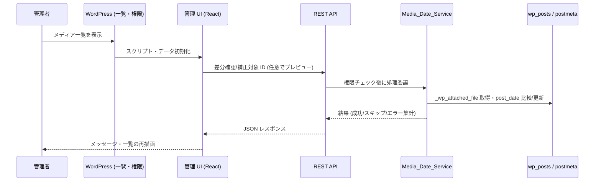

<!--
目的：「フォルダー構成、主要ファイル、技術スタック、ビルド、責務、実行ロジック」の明文化
-->

# S2J MediaLibrary Date Corrector - アーキテクチャー

## 1. フォルダー構成 (想定)

本プラグインでは、ブートストラップ (PHP)、ドメインロジック (PHP)、管理画面 UI (React)、任意のブロック/フロント資産 (React) を分離します。

```text
s2j-media-library-date-corrector/
├── `README.md`
├── `README.txt`
├── `LICENSE`
├── `package.json`  # ビルド設定
├── node_modules/  # 依存 npm モジュール
├── `vite.config.ts`
├── `tsconfig.json`
├── `eslint.config.js`  # ESLint 設定
├── docs/  # 仕様・設計ドキュメント
├── `s2j-media-library-date-corrector.php`  # プラグイン本体・フック登録
├── `uninstall.php`  # プラグイン削除時の処理
├┬─ languages/  # 翻訳ファイル
│├─ `s2j-media-library-date-corrector.pot`
│├─ `s2j-media-library-date-corrector-[ロケール名].po`
│└─ `s2j-media-library-date-corrector-[ロケール名].mo`  # WordPress 表示用バイナリ
├┬── includes/  # PHP クラス群 (設定画面、REST API、ブロック。オートロード対象)
│├── `class-plugin.php`                    # 初期化・依存登録
│├── `class-rest-controller.php`           # REST の登録と権限
│├── `class-media-date-service.php`        # 年月抽出・比較・更新の核
│├── `class-media-library-list-table.php`  # 一覧カラム・一括操作 (※)
│└── ...
├┬── src/  # TypeScript/React (Gutenberg ブロック、設定画面) /SCSS ソース
│├┬── admin/  # メディアライブラリ拡張 UI
││├─ `index.tsx`  # 管理画面メイン・エントリーポイント
││├┬─ components/
│││└── ...
││├┬─ data/
│││└─ `constants.ts`  # 定数定義 (表示形式、ランク、動作オプション)
││└┬─ utils/  # ユーティリティ
││　├─ `errorHandler.ts`  # エラー・ハンドリング
││　└── ...
│├┬─ frontend/  # フロントエンド表示
││└── ...
│├┬── gutenberg/  # Gutenberg ブロック用
││├─ `index.tsx`
││└┬─ media-library-date-corrector/  # ブロック編集
││　├─ `index.tsx`  # コンポーネント
││　└─ `block.json`  # ブロック定義
│├── classic/  # Classic エディター用スクリプト
│├── frontend/  # フロント表示用 (ブロックの view 等)
│├┬─ styles/  # プラグイン用のスタイル定義
││├─ `admin.scss`  # 設定画面用
││├─ `gutenberg.scss`  # Gutenberg ブロック用
││├─ `frontend.scss`  # フロントエンド表示用
││├─ `classic.scss`  # MetaBox 用
││└─ `variables.scss`  # SCSS 変数定義
│└┬─ types/  # プラグイン用のグローバル型定義
│　├─ `index.ts`  # ContentModel
│　├─ `wordpress.d.ts`  # WordPress
│　├─ `dom.d.ts`  # DOM
└┬─ dist/  # Vite ビルド成果物 (Git 管理外)、アイコン
　├┬─ blocks/
　│└┬─ media-library-date-corrector/
　│　└─ `block.json`  # ブロック定義
　├┬─ css/  # プラグイン用のスタイル定義
　│├─ `s2j-media-library-date-corrector-admin.css`
　│├─ `s2j-media-library-date-corrector-gutenberg.css`
　│├─ `s2j-media-library-date-corrector-frontend.css`
　│└─ `s2j-media-library-date-corrector-classic.css`
　└┬─ js/  # プラグイン用の Gutenberg ブロック、設定画面
　　├─ `s2j-media-library-date-corrector-admin.js`
　　├─ `s2j-media-library-date-corrector-gutenberg.js`
　　├─ `s2j-media-library-date-corrector-frontend.js`
　　└─ `s2j-media-library-date-corrector-classic.js`
```

**注記:** `WP_List_Table` を直接継承するのではなく、`manage_media_custom_column` 等のフィルターと `bulk_actions-upload` 等で拡張する想定です。ファイル名は実装時に確定します。

---

## 2. 主要ファイルの責務

| 領域 | 役割 |
|------|------|
| メインプラグインファイル | 定数・バージョン・ファイルパス、`plugins_loaded` でコアクラス起動、翻訳読み込み |
| `Media_Date_Service` (想定クラス名) | `_wp_attached_file` から `yyyy/mm` を抽出、`post_date` と比較、単体/一括の DB 更新。副作用をここに集約する |
| REST コントローラ | 管理画面・将来の WP-CLI から呼び出し可能な API。入力検証、権限、`service` 呼び出し |
| 管理画面 JS (`src/admin`) | 一覧の操作 UI、ローディング、REST との通信 (`api-fetch` 等)。見た目の状態遷移は [管理画面 UI 仕様](./admin_ui_spec.md) に従う |
| Gutenberg / Classic / Frontend | [ブロック仕様](./block_spec.md) に従う。本プラグインの主機能は管理画面にあるため、ブロックは補助的・将来拡張も許容 |

---

## レイヤー責務

### UI レイヤー

* 選択状態管理
* API 呼び出し
* 状態表示

### API レイヤー

* 認証・認可
* 入力検証
* レスポンス整形

### サービスレイヤー

* 日付補正ロジック
* 差分判定

### データレイヤー

* post_date 更新
* meta 取得

---

## 3. 技術スタック

| 層 | 採用技術 | 備考 |
|----|----------|------|
| 基盤 | WordPress 6.3+ (README の下限に準拠) | メディアは `attachment` 投稿タイプ |
| サーバー | PHP (WordPress 要件に準拠) | 直接 SQL は `wpdb` 経由に限定 |
| 管理 UI | React、TypeScript、`@wordpress/element` / `components` / `i18n` 等 | README の方針 |
| ビルド | Vite、Dart Sass、PostCSS (Autoprefixer) | `vite.config.ts` |
| スタイル | SCSS | `src/styles/*.scss` |

---

## 4. ビルド

### 4.1. ビルドターゲット

`vite.config.ts` の `npm_lifecycle_event` から対象を判定する：

| ターゲット | エントリ (想定) | 用途 |
|------------|------------------|------|
| `admin` | `src/admin/index.tsx` | メディアライブラリ一覧の拡張 UI |
| `gutenberg` | `src/gutenberg/index.tsx` | ブロックの登録・エディター UI |
| `classic` | `src/classic/index.ts` | Classic エディター側の補助処理 |
| `frontend` | `src/frontend/media-library-date-corrector.tsx` | ブロックのフロント表示 |

`gutenberg` ビルド時は `src/gutenberg/media-library-date-corrector/block.json` を `dist/blocks/...` にコピーする (`vite-plugin-static-copy`)。

### 4.2. 外部化

Rollup の `external` に `@wordpress/*`、`react`、`react-dom`、`jquery` を指定し、管理画面で WordPress が既に提供するグローバル (`wp.*`、`React` 等) にマッピングする。

### 4.3. 出力

* 出力先：`ディストリビューションのルート/dist` (`emptyOutDir: false` でターゲット間の連続ビルドを想定)
* `FLUSH_DIST=true` でビルド前に `dist` を削除可能
* 本番時は `NODE_ENV=production` で minify

> **実装上の注意:** 現行 `vite.config.ts` の成果物ファイル名に別プロジェクト由来の接頭辞が含まれる場合は、リリース前にプラグインスラッグへ統一することを推奨する。

---

## 5. 実行ロジック (エンドツーエンド)

以下は [コンセプト](./concept.md) の「補正ロジック」と [管理画面 UI 仕様](./admin_ui_spec.md) の操作をサーバー/クライアントに分割した流れである。



1. **表示**: メディア一覧で標準カラムに加え、「年月 (パス)」「差分」を表示する (PHP フィルターまたは初期データと REST の組み合わせ。実装方針は一覧のデータ取得コストに応じて選択)。
2. **選択**: ユーザーがチェックボックスで対象を選ぶ、または「差分のみ選択」等の UI 操作。
3. **実行**: UI が REST へ補正リクエスト。サーバー側で **各添付ファイルごと** に `current_user_can` を検証する。
4. **更新**: `Media_Date_Service` が `yyyy/mm-01 00:00:00` (サイトタイムゾーン) へ `post_date` を揃え、必要に応じて `post_date_gmt` も整合させる (詳細は [データ辞書](./data_dictionary.md))。
5. **完了**: UI が成功/失敗を表示し、一覧を更新する。

バッチ件数が大きい場合は、REST でチャンク処理するか、バックグラウンドキュー (将来拡張) を検討する。初期実装では「1リクエスト＝限定件数」でタイムアウトを避ける。

---

## 6. 共通仕様との関係

プラグイン全体の規約・品質・セキュリティの共通ルールは、[WP_PLUGIN_SPEC.md](https://github.com/stein2nd/wp-plugin-spec/blob/main/docs/WP_PLUGIN_SPEC.md) に従う。
