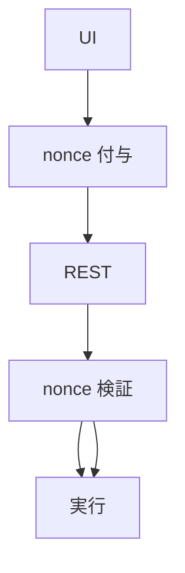
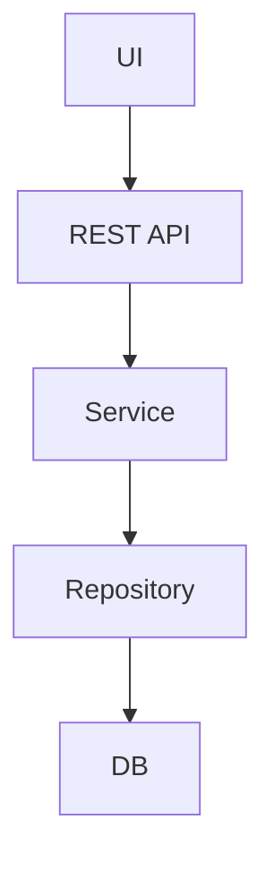
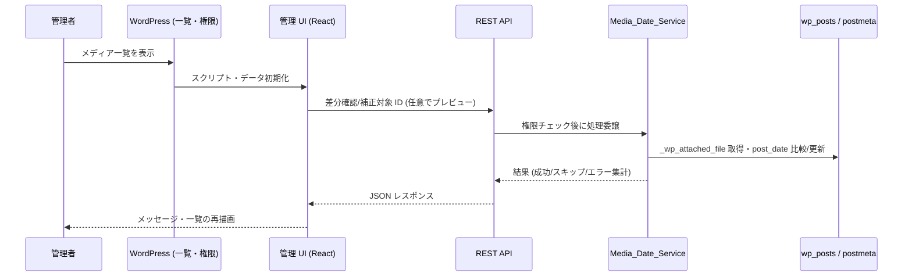

<!--
目的：「フォルダー構成、主要ファイル、技術スタック、ビルド、責務、実行ロジック」の明文化
-->

# S2J MediaLibrary Date Corrector - アーキテクチャー

## フォルダー構成 (想定)

本プラグインでは、ブートストラップ (PHP)、ドメインロジック (PHP)、管理画面 UI (React)、任意のブロック/フロント資産 (React) を分離します。

```text
s2j-media-library-date-corrector/
├── `README.md`
├── `README.txt`
├── `LICENSE`
├── `package.json`  # ビルド設定
├── node_modules/  # 依存 npm モジュール
├── `vite.config.ts`
├── `tsconfig.json`
├── `eslint.config.js`  # ESLint 設定
├── docs/  # 仕様・設計ドキュメント
├── `s2j-media-library-date-corrector.php`  # プラグイン本体・フック登録
├── `uninstall.php`  # プラグイン削除時の処理
├┬─ languages/  # 翻訳ファイル
│├─ `s2j-media-library-date-corrector.pot`
│├─ `s2j-media-library-date-corrector-[ロケール名].po`
│└─ `s2j-media-library-date-corrector-[ロケール名].mo`  # WordPress 表示用バイナリ
├┬── includes/  # PHP クラス群 (設定画面、REST API、ブロック。オートロード対象)
│├── `class-plugin.php`                    # 初期化・依存登録
│├── `class-rest-controller.php`           # REST の登録と権限
│├── `class-media-date-service.php`        # 年月抽出・比較・更新の核
│├── `class-media-library-list-table.php`  # 一覧カラム・一括操作 (※)
│└── ...
├┬── src/  # TypeScript/React (Gutenberg ブロック、設定画面) /SCSS ソース
│├┬── admin/  # メディアライブラリ拡張 UI
││├─ `index.tsx`  # 管理画面メイン・エントリーポイント
││├┬─ components/
│││└── ...
││├┬─ data/
│││└─ `constants.ts`  # 定数定義 (表示形式、ランク、動作オプション)
││└┬─ utils/  # ユーティリティ
││　├─ `errorHandler.ts`  # エラー・ハンドリング
││　└── ...
│├┬─ frontend/  # フロントエンド表示
││└── ...
│├┬── gutenberg/  # Gutenberg ブロック用
││├─ `index.tsx`
││└┬─ media-library-date-corrector/  # ブロック編集
││　├─ `index.tsx`  # コンポーネント
││　└─ `block.json`  # ブロック定義
│├── classic/  # Classic エディター用スクリプト
│├── frontend/  # フロント表示用 (ブロックの view 等)
│├┬─ styles/  # プラグイン用のスタイル定義
││├─ `admin.scss`  # 設定画面用
││├─ `gutenberg.scss`  # Gutenberg ブロック用
││├─ `frontend.scss`  # フロントエンド表示用
││├─ `classic.scss`  # MetaBox 用
││└─ `variables.scss`  # SCSS 変数定義
│└┬─ types/  # プラグイン用のグローバル型定義
│　├─ `index.ts`  # ContentModel
│　├─ `wordpress.d.ts`  # WordPress
│　├─ `dom.d.ts`  # DOM
└┬─ dist/  # Vite ビルド成果物 (Git 管理外)、アイコン
　├┬─ blocks/
　│└┬─ media-library-date-corrector/
　│　└─ `block.json`  # ブロック定義
　├┬─ css/  # プラグイン用のスタイル定義
　│├─ `s2j-media-library-date-corrector-admin.css`
　│├─ `s2j-media-library-date-corrector-gutenberg.css`
　│├─ `s2j-media-library-date-corrector-frontend.css`
　│└─ `s2j-media-library-date-corrector-classic.css`
　└┬─ js/  # プラグイン用の Gutenberg ブロック、設定画面
　　├─ `s2j-media-library-date-corrector-admin.js`
　　├─ `s2j-media-library-date-corrector-gutenberg.js`
　　├─ `s2j-media-library-date-corrector-frontend.js`
　　└─ `s2j-media-library-date-corrector-classic.js`
```

**注記:** `WP_List_Table` を直接継承するのではなく、`manage_media_custom_column` 等のフィルターと `bulk_actions-upload` 等で拡張する想定です。ファイル名は実装時に確定します。

## 主要ファイルの責務

| 領域 | 役割 |
|------|------|
| メインプラグインファイル | 定数・バージョン・ファイルパス、`plugins_loaded` でコアクラスを起動し、翻訳をロードします。 |
| `Media_Date_Service` (想定クラス名) | `_wp_attached_file` から `yyyy/mm` を抽出し、`post_date` と比較し、単体/一括の DB 更新を行います。副作用をここに集約します。 |
| REST コントローラ | 管理画面・将来の WP-CLI からコール可能な API です。入力検証、権限、`service` の呼び出しを担います。 |
| 管理画面 JS (`src/admin`) | 一覧の操作 UI、ローディング、REST との通信 (`api-fetch` 等) を扱います。見た目の状態遷移は [管理画面 UI 仕様](./admin_ui_spec.md) に従います。 |
| Gutenberg/Classic/Frontend | [ブロック仕様](./block_spec.md) に従います。本プラグインの主機能は管理画面にあるため、ブロックは補助的に扱い、将来拡張も許容します。 |

## レイヤー責務

### UI レイヤー

* 選択状態の管理
* API のコール
* 状態の表示

### API レイヤー

* 認証・認可
* 入力の検証
* レスポンスの整形

### サービスレイヤー

* 日付補正を担います。
* 差分を判定します。

### データレイヤー

* `post_date` の更新
* meta の取得

## 権限設計 (Capabilities)

本プラグインは、WordPress の権限モデルにもとづき、操作画面と設定画面で異なる権限を適用します。

### メディア補正画面

* capability: `upload_files`
* 対象ユーザー: 投稿者以上

理由:

* メディア操作権限と整合しているためです。
* 既存のメディア管理フローに準拠するためです。

### 設定画面

* capability: `manage_options`
* 対象ユーザー: 管理者のみ

理由:

* システム全体に影響し得る設定を扱うためです。

### REST API

* nonce による認証が必須です。
* capability チェックを必須とします。

### 設計方針

* 権限は、「最小権限の原則」に従います。
* UI と API で、同一の権限チェックを行います。

### nonce 設計 (REST API)

REST API コールは、WordPress の nonce による認証が必須です。

#### 使用方式

* `wp_create_nonce('wp_rest')` を使用します。
* クライアントは `X-WP-Nonce` ヘッダーとして送信します。

#### フロントエンド実装

* `wpApiSettings.nonce` を利用します。
* `@wordpress/api-fetch` により自動付与されます。

#### 検証

* WordPress REST API の標準機構により検証されます。
* nonce が無効な場合は、`401` を返します。

#### 設計方針

* Cookie 認証と nonce による、CSRF 対策を採用します。
* 独自トークンは導入せず、WordPress 標準に準拠します。

#### 注意点

* nonce は、「認証」ではなく「CSRF 対策」です。
* capability チェックとの組み合わせが必須です。

### capability の粒度設計

本プラグインでは、WordPress 標準 capability を基本とし、過度な細分化は行いません。

#### 基本方針

* 既存 capability を優先して使用します。
* (初期リリースでは) カスタム capability は導入しません。

#### 採用する capability

| 機能 | capability |
| ------ | ---------------- |
| メディア補正 | `upload_files` |
| 設定変更 | `manage_options` |

#### 粒度の考え方

本プラグインは、以下の理由により、細分化を行いません。

* 機能が、単一責務 (日時補正) にとどまるためです。
* WordPress の既存権限モデルと整合しているためです。
* 権限管理の「複雑化の回避」を維持するためです。

#### 将来的な拡張

必要に応じて、以下のカスタム capability 導入を検討します。

* `s2j_correct_media_date`
* `s2j_manage_settings`

ただし、導入検討のタイミングは、以下の条件を満たす場合に限定されます。

* 機能が増加し、責務が分離されていること
* 権限分離の要件が、明確になっていること

#### REST API における適用

* 各リクエストごとに `current_user_can` を実行します。
* ID 単位で権限チェックを行います。

#### 設計方針

* 「最小権限の原則」を維持します。
* UI と API の権限を一致させます。

### 適用レイヤー

* UI レイヤー: 表示の制御
* API レイヤー: 権限のチェック
* サービスレイヤー: 実行可否の判断

### permission_callback 実装例

REST API の各エンドポイントでは、`permission_callback` により、認可チェックを実装します。

#### 基本実装

```php
register_rest_route(
  's2j/v1',
  '/media/date-correct',
  [
    'methods'  => 'POST',
    'callback' => [ $this, 'handle_date_correct' ],
    'permission_callback' => [ $this, 'can_correct_media' ],
  ]
);
```

#### `permission_callback` の実装

```php
public function can_correct_media( WP_REST_Request $request ) {
  // 基本権限チェック
  if ( ! current_user_can( 'upload_files' ) ) {
    return new WP_Error(
      'rest_forbidden',
      __( 'You do not have permission to correct media.', 's2j-media-library-date-corrector' ),
      [ 'status' => 403 ]
    );
  }

  // ID 単位の追加チェック (任意)
  $ids = $request->get_param( 'ids' );

  if ( is_array( $ids ) ) {
    foreach ( $ids as $id ) {
      if ( ! current_user_can( 'edit_post', $id ) ) {
        return new WP_Error(
          'rest_forbidden',
          __( 'You cannot edit one or more items.', 's2j-media-library-date-corrector' ),
          [ 'status' => 403 ]
        );
      }
    }
  }

  return true;
}
```

#### 設計ポイント

* capability は、「操作単位」と「対象単位」の2段階でチェックします。
* エラーは、`WP_Error` で統一します。
* ステータスコードは `403` を返します。

#### 方針

* `permission_callback` は、(省略せず) 必ず定義します。
* ロジックは、Controller に集約します。

### `api-fetch` ミドルウェア設計

管理画面の API 通信は、`@wordpress/api-fetch` を使用し、共通ミドルウェアを導入します。

#### 目的

* nonce の自動付与
* エラーハンドリングの統一
* ログ・デバッグの一元化

#### 基本設定

```ts
import apiFetch from '@wordpress/api-fetch';

apiFetch.use( apiFetch.createNonceMiddleware( wpApiSettings.nonce ) );
```

#### カスタムミドルウェア

```ts
apiFetch.use( ( options, next ) => {
  return next( options ).catch( ( error ) => {
    console.error( 'API Error:', error );

    // 共通エラーハンドリング
    if ( error.code === 'rest_forbidden' ) {
      alert( '権限がありません' );
    }

    throw error;
  });
});
```

#### 設計方針

* nonce は、middleware で一元管理します。
* 各コンポーネントで、個別付与しません。
* エラーハンドリングは、共通化します。

#### 拡張ポイント

将来的に、以下の機能追加を検討します。

* リトライ処理
* ローディング管理
* 通信ログ収集

#### 注意点

* middleware は、グローバルに1回だけ登録します。
* 多重登録を防ぎます。

### 認証・認可フロー



## 処理フロー (レイヤー横断)



* UI: 選択と実行
* REST: 認証とバリデーション
* Service: 補正ロジックの実行
* Repository: 更新処理

## 冪等性 (べきとうせい)

同一データに対して、複数回実行しても結果は変わりません。

## 技術スタック

| 層 | 採用技術 | 備考 |
|----|----------|------|
| 基盤 | WordPress 6.3+ (README の下限に準拠) | メディアは `attachment` 投稿タイプです。 |
| サーバー | PHP (WordPress 要件に準拠) | 直接 SQL は `wpdb` 経由に限定します。 |
| 管理 UI | React、TypeScript、`@wordpress/element`、`components`、`i18n` 等 | README 記載の方針。 |
| ビルド | Vite、Dart Sass、PostCSS (Autoprefixer) | ビルドの定義は、`vite.config.ts` にあります。 |
| スタイル | SCSS | スタイルのソースは、`src/styles/*.scss` です。 |

## ビルド

### ビルドターゲット

`vite.config.ts` の `npm_lifecycle_event` から対象を判定します。

| ターゲット | エントリ (想定) | 用途 |
|------------|------------------|------|
| `admin` | `src/admin/index.tsx` | メディアライブラリ一覧の拡張 UI です。 |
| `gutenberg` | `src/gutenberg/index.tsx` | ブロックの登録とエディター UI です。 |
| `classic` | `src/classic/index.ts` | Classic エディター側の補助処理です。 |
| `frontend` | `src/frontend/media-library-date-corrector.tsx` | ブロックのフロント表示です。 |

`gutenberg` ビルド時は `src/gutenberg/media-library-date-corrector/block.json` を `dist/blocks/...` にコピーします (`vite-plugin-static-copy`)。

### 外部化

Rollup の `external` に `@wordpress/*`、`react`、`react-dom`、`jquery` を指定し、管理画面で WordPress がすでに提供しているグローバル (`wp.*`、`React` 等) にマッピングします。

### 出力

* 出力先は `ディストリビューションのルート/dist` とし、`emptyOutDir: false` でターゲット間の連続ビルドを想定します。
* `FLUSH_DIST=true` の場合、ビルド前に `dist` を削除できます。
* 本番時は `NODE_ENV=production` で、成果物を縮小 (minify) します。

> **実装上の注意:** 現行 `vite.config.ts` の成果物ファイル名に別プロジェクト由来の接頭辞が含まれる場合は、リリース前にプラグインスラッグへ統一することを推奨します。

## 実行ロジック (エンドツーエンド)

以下は [コンセプト](./concept.md) の「補正ロジック」と [管理画面 UI 仕様](./admin_ui_spec.md) の操作をサーバー/クライアントに分割した流れです。



1. **表示**: メディア一覧で標準カラムに加え、「年月 (パス)」「差分」を表示します (PHP フィルターまたは初期データと REST の組み合わせです。実装方針は一覧のデータ取得コストに応じて選択します)。
2. **選択**: ユーザーがチェックボックスで対象を選ぶか、「差分のみ選択」等を行います。
3. **実行**: UI が REST へ補正リクエストを送ります。サーバー側で **各添付ファイルごと** に `current_user_can` を検証します。
4. **更新**: `Media_Date_Service` が `yyyy/mm-01 00:00:00` (サイトのタイムゾーン) へ `post_date` をそろえ、必要に応じて `post_date_gmt` も整合させます (詳細は [データ辞書](./data_dictionary.md) を参照します)。
5. **完了**: UI が成功/失敗を表示し、一覧を更新します。

バッチ件数が大きい場合は、REST でチャンク処理するか、バックグラウンドキュー (将来拡張) を検討します。初期実装では「1リクエスト=限定件数」でタイムアウトを避けます。

---

## 共通仕様との関係

プラグイン全体の規約・品質・セキュリティの共通ルールは、[WP_PLUGIN_SPEC.md](https://github.com/stein2nd/wp-plugin-spec/blob/main/docs/WP_PLUGIN_SPEC.md) に従います。
