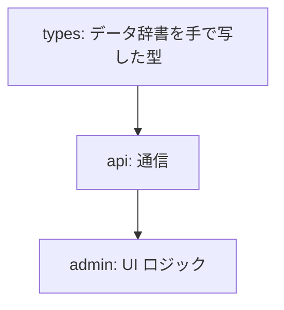
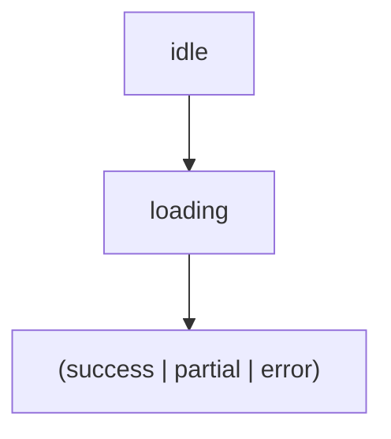
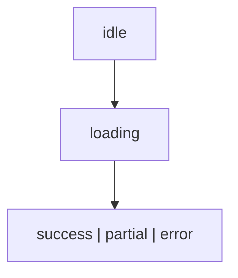
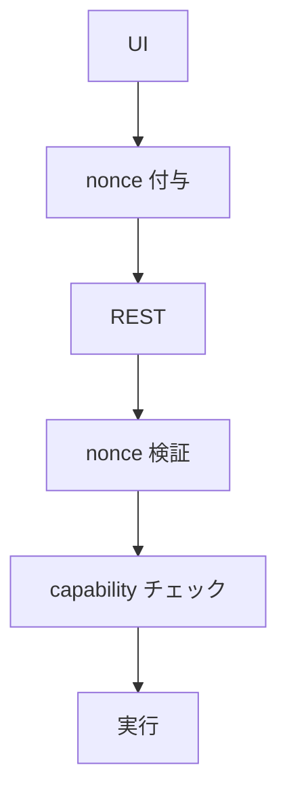
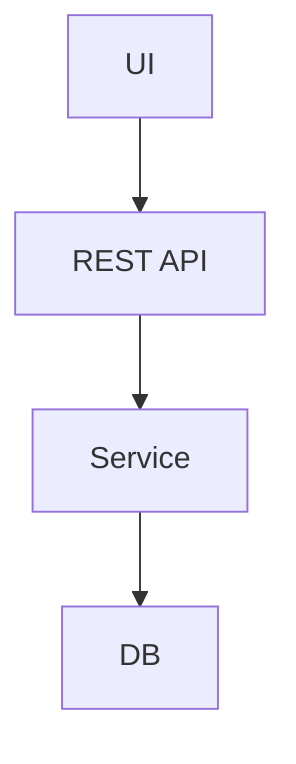
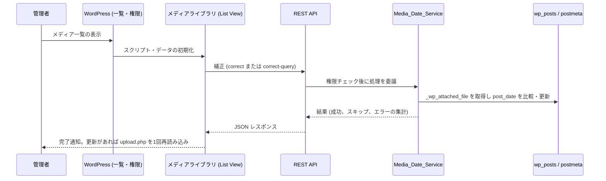

<!--
目的：「フォルダー構成、主要ファイル、技術スタック、ビルド、責務、実行ロジック」の明文化
-->

# S2J MediaLibrary Date Corrector - アーキテクチャー

## フロントエンド構成 (types、api)

フロントエンドのデータ処理層は、下記のディレクトリ構成で管理します。

### 設計方針 (規約)

* 責務ごとにディレクトリを分離する。
* 副作用 (API) は、`api/` に閉じ込める。
* 型は、データ辞書を手で写す。初期リリースでは自動生成しない。

#### 副作用 (API) の扱い

本プロジェクトでは、外部との通信や状態変更を伴う処理を、関数型・アーキテクチャー文脈の用語を用いて「副作用」と定義します。

* 副作用の例:
  * REST API 呼び出し
  * ネットワーク通信
  * ストレージ操作

### フォルダー構成 (想定)

本プラグインでは、ブートストラップ (PHP)、ドメインロジック (PHP)、管理画面 UI (React) を分離します。初期リリースのビルド対象は `admin` だけです。

```text
s2j-media-library-date-corrector/
├── `README.md`
├── `README.txt`
├── `LICENSE`
├── `package.json`  # ビルド設定
├── node_modules/  # 依存 npm モジュール
├── `vite.config.ts`
├── `tsconfig.json`
├── `eslint.config.js`  # ESLint 設定
├── docs/  # 仕様・設計ドキュメント
├── `s2j-media-library-date-corrector.php`  # プラグイン本体・フック登録
├── `uninstall.php`  # プラグイン削除時の処理
├┬─ languages/  # 翻訳ファイル
│├─ `s2j-media-library-date-corrector.pot`
│├─ `s2j-media-library-date-corrector-{ロケール名}.po`
│└─ `s2j-media-library-date-corrector-{ロケール名}.mo`  # WordPress 表示用バイナリ
├┬─ includes/  # PHP クラス群 (REST API、一覧拡張。オートロード対象)
│├─ `class-plugin.php`                    # 初期化・依存登録
│├─ `class-rest-controller.php`           # REST の登録と権限
│├─ `class-media-date-service.php`        # 年月抽出・比較・更新の核
│├─ `class-media-library-list-table.php`  # 一覧カラム・一括操作 (※)
│└─ ...
├┬─── src/  # TypeScript/React (管理画面) /SCSS ソース
│├┬── admin/  # メディアライブラリ拡張 UI
││├── `index.tsx`  # 管理画面メイン・エントリーポイント
││├┬─ media-corrector/
│││├─ `reducer.ts`  # 状態管理
│││└─ `actions.ts`  # アクション定義
││├┬─ components/
│││└─ ...
││├┬─ data/
│││└─ `constants.ts`  # 定数定義
││└┬─ utils/  # ユーティリティ
││　├─ `errorHandler.ts`  # エラー・ハンドリング
││　└─ ...
│├┬─ api/  # API 通信
││├─ `client.ts`  # API コール (`api-fetch` ラッパー)
││└─ `endpoints.ts`  # エンドポイント定義
│├┬─ styles/  # プラグイン用のスタイル定義
││├─ `admin.scss`  # 操作画面用
││└─ `variables.scss`  # SCSS 変数定義
│└┬─ types/  # プラグイン用のグローバル型定義
│　├─ `index.ts`
│　├─ `api.ts`  # TypeScript 型 (データ辞書を手で写す)
│　├─ `wordpress.d.ts`  # WordPress
│　└─ `dom.d.ts`  # DOM
└┬── dist/  # Vite ビルド成果物 (Git 管理外)、アイコン
　├┬─ css/  # プラグイン用のスタイル定義
　│└─ `s2j-media-library-date-corrector-admin.css`
　└┬─ js/  # 管理画面
　　└─ `s2j-media-library-date-corrector-admin.js`
```

**注記:** `WP_List_Table` を直接継承するのではなく、`manage_media_custom_column` 等のフィルターと `bulk_actions-upload` 等で拡張する想定です。ファイル名は実装時に確定します。

### 各フォルダーの責務

| フォルダー | 役割 |
| --- | --- |
| `admin/` | UI ロジック |
| `api/` | API 通信 (副作用) |
| `types/` | データ辞書を手で写した型 |

#### 依存関係


```mermaid
flowchart TD
  A["types: データ辞書を手で写した型"] --> B["api: 通信"]
  B --> C["admin: UI ロジック"]
```

### 主要ファイルの責務

| 領域 | 役割 |
| --- | --- |
| メインプラグインファイル | 定数・バージョン・ファイルパス、`plugins_loaded` でコアクラスを起動し、翻訳をロードする。 |
| `Media_Date_Service` (想定クラス名) | `_wp_attached_file` から `yyyy/mm` を抽出し、`post_date` と比較し、単体/一括の DB 更新を行う。副作用をここに集約する。 |
| REST コントローラ | 管理画面から呼ぶ API である。補正処理は画面の表示から切り離し、入力検証、権限、`service` の呼び出しを担う。WP-CLI コマンドは、初期リリースでは置かない。 |
| 管理画面 JS (`src/admin`) | `upload.php` の List View 上で、補正の実行、処理中の表示、REST 通信 (`api-fetch`) を扱う。一覧テーブルは再構築しない。状態遷移は [管理画面 UI 仕様](./admin_ui_spec.md) に従う。スクリプトは `admin_enqueue_scripts` で、`upload.php` の場合だけ読む。 |

### レイヤー責務

#### 設計意図 (ゴール)

* サービス層の判定ロジックを、副作用から切り離して保つ (`features/` ディレクトリは置かない)。
* テスト容易性を向上させる。
* 実装変更 (API 変更等) の影響範囲を限定する。

#### 方針 (規約)

クライアントの副作用 (REST 呼び出し) は、`src/api/` に集約します。認可・入力検証・応答整形は、PHP の REST コントローラが担います。`src/api/` には認可ロジックを置きません。

#### UI レイヤー (クライアント)

* 選択状態の管理
* REST のコール (`src/api/`)
* 状態の表示

#### クライアント `src/api/`

* `api-fetch` による通信 (副作用)
* エンドポイント定義
* 認可や capability の判定は置かない (サーバー側)

#### REST (PHP)

* 認証 (nonce) と認可 (`permission_callback` / 件別 `edit_post`)
* 入力の検証 (`register_rest_route` の `args`)
* レスポンスの整形

#### サービスレイヤー (PHP)

* 日付補正を担う。
* 差分を判定する。

#### データレイヤー

Service 内の DB 読み書きを指す概念です。Repository クラスは置きません。

* `post_date` の更新
* meta の取得

## 責務分離ポリシー - What と How

本プロジェクトでは、仕様 (What) と実装 (How) を明確に分離します。

### 設計方針 (規約)

* UI 仕様は、技術に依存しない形で記述する。
* 実装詳細は、すべて [アーキテクチャー](./architecture.md) に集約する。
* 両者は、参照関係を持つが、重複しない。

### 仕様 - What

[管理画面の UI 仕様](./admin_ui_spec.md) では、下記の事項を定義します。

* UI の構造
* 操作仕様
* 状態遷移
* スコープ定義
* 表示ルール

### 実装 - How

本ドキュメントでは、下記を定義します。

* API コール方法 (`api-fetch`)
* state 管理方式
* ミドルウェア構成
* エラーハンドリング
* 非同期処理 (チャンク、リトライ)

### 境界ルール

| 項目 | 記述先 |
| --- | --- |
| UI の見た目・動き | [管理画面の UI 仕様](./admin_ui_spec.md) |
| データ取得方法 | [アーキテクチャー](./architecture.md) |
| state の型・構造 | [アーキテクチャー](./architecture.md) |
| UX 要件 (現在ページの選択、All の対象範囲) | [管理画面の UI 仕様](./admin_ui_spec.md) |
| 実装方法 (リストテーブルのフック、REST) | [アーキテクチャー](./architecture.md) |

### ソース・オブ・トゥルース (Source of Truth)

初期リリースのフィールドの契約は、[データ辞書](./data_dictionary.md#typescript-型定義-完全版) の型です。管理画面の TypeScript は、この型を手で写します。

権限、ステータス、`nextOffset` などの振る舞いは、[REST 仕様](./rest_api_spec.md) に書きます。フィールド名と型は、データ辞書を指します。

サーバーの実行時チェックは、`register_rest_route` の `args` です。PHP は zod を実行しません。

OpenAPI、zod、生成スクリプトは、初期リリースに置きません。`openapi.json` も置きません。

後から機械可読な契約を足す場合は、向きは1つです。データ辞書と REST 仕様から OpenAPI を作り、そこからクライアントの型を生成します。zod は、ブラウザが応答を確かめる任意の層です。書き込みの正本にはしません。

仕様変更は、データ辞書の型と REST 仕様から始めます。実装側の型だけを変えて、契約を変えることはしません。

## 権限設計 (Capabilities)

本プラグインは、WordPress の権限モデルにもとづき、メディアの日付補正では `upload_files` を適用します。設定画面の保存は `manage_options` です。カスタム capability は置きません。

### 設計方針 (規約)

* 権限は、「最小権限の原則」に従います。
* UI と API で、同一の権限チェックを行います。

### メディア補正画面

* capability: `upload_files`
* 対象ユーザー: 投稿者以上
* 理由:
  * メディア操作権限と整合しているためである。
  * 既存のメディア管理フローに準拠するためである。

### REST API

* nonce による認証が必須である。
* capability のチェックを、必ず行う。

### REST API における前提 capability

REST API は、メディア補正画面と同様に、`upload_files` を前提とします。

これにより、UI と API の権限モデルを統一します。

### nonce 設計 (REST API)

REST API コールは、WordPress の nonce による認証が必須です。

#### 設計方針 (規約)

* Cookie 認証と nonce による、CSRF 対策を採用する。
* 独自トークンは導入しない。WordPress 標準に準拠する。

#### 注意点

* nonce は、「認証」ではなく「CSRF 対策」である。
* capability チェックとの組み合わせが必須である。

#### 使用方式

* `wp_create_nonce('wp_rest')` を使用する。
* クライアントは `X-WP-Nonce` ヘッダーとして送信する。

#### フロントエンド実装

* `wpApiSettings.nonce` を利用する。
* `@wordpress/api-fetch` により自動付与される。

#### 検証

* WordPress REST API の標準機構により検証される。
* `X-WP-Nonce` が `wp_rest` と合わない場合、コアの `rest_cookie_check_errors` が `permission_callback` より先に `403` を返す。コードは `rest_cookie_invalid_nonce` である。
* プラグインは、無効な nonce に対して `401` を返す処理を置かない。

### capability の粒度設計

本プラグインでは、WordPress 標準 capability を基本とします。過度な細分化は行いません。

#### 設計方針 (規約)

* 「最小権限の原則」を維持する。
* UI と API の権限を一致させる。

#### 基本方針

* 既存 capability を優先して使用する。
* (初期リリースでは) カスタム capability は、導入しない。

#### 採用する capability

| 機能 | capability |
| --- | --- |
| メディア補正 | `upload_files` |
| 設定画面の保存 | `manage_options` |

#### 粒度の考え方

本プラグインは、下記の理由により、細分化を行いません。

* 機能が、単一責務 (日時補正) にとどまるためである。
* WordPress の既存権限モデルと整合しているためである。
* 権限管理の「複雑化の回避」を維持するためである。

#### 将来的な拡張

初期リリースでは、カスタム capability は登録しません。ルートの権限は `upload_files` のままです。

`s2j_correct_media_date` は、初期リリースでは作りません。あとから足すのは、下記をすべて満たす場合だけです。

* 機能が増加し、責務が分離されていること。
* 権限分離の要件が、明確になっていること。

#### REST API における適用

* `permission_callback` では、`upload_files` だけを見る。
* 各 ID の `edit_post` は、処理ループの中で見る。不足した件は `ResultItem` の `error` とし、他の件は続ける。

### リクエストの実行時チェック

サーバーは、`register_rest_route` の `args` でリクエストの形を確かめます。フィールドの正は、データ辞書です。

PHP は zod を実行しません。初期リリースでは、zod スキーマも置きません。

クライアントは、データ辞書の型を手で写します。応答の形が契約と違う場合は、完了通知で失敗として扱います。

### 適用レイヤー

* UI レイヤー (クライアント): 表示の制御
* REST (PHP): 権限のチェック
* サービスレイヤー (PHP): 実行可否の判断

### permission_callback 実装例

REST API の各エンドポイントでは、`permission_callback` により、認可チェックを実装します。

#### 方針

* `permission_callback` を省略することはしない。必ず定義する。
* ロジックは、Controller に集約する。

#### 設計ポイント

* `permission_callback` は、このルートを呼んでよいかだけを見る。ID では全体を拒否しない。
* `permission_callback` が見るのは `upload_files` だけである。不足した場合のステータスは `rest_authorization_required_code()` に任せる。ログインしていなければ `401`、ログイン済みなら `403` である。
* nonce が無効な場合は、コアの `rest_cookie_check_errors` が先に `403` を返す。プラグインはこの判定を置かない。
* 受理後の `edit_post` 不足は、その1件を `status` `error` にし、`message` に人間が読める文を入れる。HTTP は `200` のまま、他の件は続ける。

#### 基本実装

名前空間は、定数 `S2J_MLDC_REST_NAMESPACE` (`s2j-mldc/v1`) だけを使います。`correct-query` も同じ定数で登録します。

```php
register_rest_route(
  S2J_MLDC_REST_NAMESPACE,
  '/attachments/correct',
  [
    'methods'             => 'POST',
    'callback'            => [ $this, 'handle_date_correct' ],
    'permission_callback' => [ $this, 'can_correct_media' ],
  ]
);
```

#### `permission_callback` の実装

```php
public function can_correct_media( WP_REST_Request $request ) {
  if ( ! current_user_can( 'upload_files' ) ) {
    return new WP_Error(
      'rest_forbidden',
      __( 'メディアの日付を補正する権限がありません。', 's2j-media-library-date-corrector' ),
      [ 'status' => rest_authorization_required_code() ]
    );
  }

  return true;
}
```

#### 件別の `edit_post`

```php
if ( ! current_user_can( 'edit_post', $id ) ) {
  $results[] = [
    'id'      => $id,
    'status'  => 'error',
    'message' => __( 'この項目を編集する権限がありません。', 's2j-media-library-date-corrector' ),
  ];
  continue;
}
```

### `api-fetch` ミドルウェア設計

管理画面の API 通信は、`@wordpress/api-fetch` を使用します。共通ミドルウェアを導入します。

#### 設計意図 (ゴール)

* nonce の自動付与
* 応答本文がない場合の自動再送

#### 設計方針 (規約)

* nonce は、middleware で一元管理する。
* 各コンポーネントで、個別付与しない。
* エラーハンドリングは、共通化する。

#### 注意点

* middleware は、グローバルに1回だけ登録する。
* 多重登録を防ぐ。

#### 基本設定

```ts
import apiFetch from '@wordpress/api-fetch';

apiFetch.use( apiFetch.createNonceMiddleware( wpApiSettings.nonce ) );
```

#### 初期リリース

ミドルウェアが行うのは、下記です。

* nonce の付与。`apiFetch.createNonceMiddleware` を、グローバルに1回だけ登録する。
* 応答本文がない場合の自動再送。同じチャンクを最大3回である。対象は、ネットワーク失敗、タイムアウト、HTTP `408`、`429`、`500`、`502`、`503`、`504` である。

Retry Failed は、ミドルウェアの自動再送ではありません。`HTTP 200` の `status === "error"` の ID だけを `/attachments/correct` に再送します。

処理中は、ローディング、操作ボタンの無効化、および処理中メッセージを出します。初回応答前は「処理中です…」、直近の `summary.total` がある場合は「{count} 件を処理中です…」です (一連の累計ではありません。上限100の暫定表示は使いません。文言の正本は [管理画面 UI 仕様](./admin_ui_spec.md))。プログレスバーは作りません。

完了は、画面上部の通知1つです。見出しは `summary` の件数です。失敗が混ざる場合と、`processed < total` の場合は警告です。同じ通知にサーバーの `message` を足すのは、`error` の件と、`message` がある `skipped` の件です。`success` の `message` は足しません。行の中には出しません。`results` はデバッグ出力にしません。Toast、共通の Message コンポーネント、`window.alert` は使いません。

#### 拡張ポイント

通信ログの収集は、初期リリースでは作りません。ミドルウェアは、nonce の付与と、応答本文がない場合の自動再送だけです。

### フロント状態管理 (error / success / retry)

フロントエンドは、REST API のレスポンスに応じて、明確な状態遷移を持ちます。

#### 設計方針 (規約)

* 状態は、単一の「state machine」として扱う。
* 表示と状態を分離する。
* API レスポンスを、そのまま UI 状態にマッピングする。

#### 状態定義

UI 状態は、REST API の `status` と一致させます。

* idle: 初期状態
* loading: API ロード中
* success: 失敗がなく、処理が最後まで終わった状態である。`skipped` だけも含む
* partial: 失敗が混ざる、または未処理が残る状態である
* error: 処理した件がすべて失敗である

#### 状態遷移


```mermaid
flowchart TD
  A["idle"] --> B["loading"]
  B --> C["(success | partial | error)"]
```

#### state 構造 (例)

`summary` は、[データ辞書](./data_dictionary.md) の `Summary` です。フィールドは、`total`、`processed`、`success`、`skipped`、`failed` です。

未処理の件数は、`total - processed` として画面が計算します。`summary` に6つ目のフィールドは足しません。

```ts
{
  status: 'idle' | 'loading' | 'success' | 'partial' | 'error',
  summary: {
    total: number,
    processed: number,
    success: number,
    skipped: number,
    failed: number
  } | null,
  results: ResultItem[]
}
```

`results` も残します。完了の通知が、`error` の `message` と、`message` がある `skipped` をここから取るためです。見出し用の `message` 文字列1本にはまとめません。`idle` と `loading` の間は、`summary` は `null`、`results` は空配列です。

#### UI 挙動

* success:
  * 画面上部の通知を成功にする。`summary.success` が1件以上なら「{success} 件の補正が完了しました」である。`skipped` があれば「{skipped} 件は更新しませんでした」を足す。`summary.success` が0で残りが `skipped` なら「更新した項目はありません」である。
* partial:
  * 画面上部の通知を警告にする。成功、失敗、スキップの件数である。未処理が残る場合は「一部未処理の項目があります」を足す。
  * `skipped` だけでは、この状態にしない。
* error:
  * 画面上部の通知をエラーにする。文は「処理に失敗しました」である。
  * 再試行可能な状態にする。

一覧は PHP のリストテーブルです。日付列と差分列を更新後の値にするには、いまの `upload.php` を再読み込みします。再読み込みするのは、一連の補正が終わって、その中の加算後 `summary.success` が1件でもある場合だけです。回数は1回です。検索、フィルター、表示中のページは維持します。再読み込み前に、完了通知の内容を、そのタブの `sessionStorage` に置きます。再読み込みしたあと、画面上部に1つ出して、そのキーは消します。再読み込みのたびに同じ通知は出しません。option、Transient、ユーザーメタには書きません。

再読み込みしないのは、下記の場合です。

* 走査窓または ID 分割の途中です。`processed === total` かつ `nextOffset !== null` の間と、ID を分割してまだ送っている間は、画面にとどまる。
* 更新が1件もない場合です。スキップと失敗だけ、または `HTTP 400` だけの場合は、日付列が変わっていないので再読み込みしない。

Date Correct (All) では、一連の終了まで `summary` を加算し、`results` を連結します。次窓に進むのは `processed === total` かつ `nextOffset !== null` の場合だけです。`processed < total` の場合は一連をやめ、集約結果で警告します。完了時の UI `status` と Retry Failed は、その集約結果から決めます。

#### リトライ処理の設計

フロントエンドにおけるリトライ処理は、REST API 仕様に従って実装します。

#### 基本動作

* 応答本文が得られなかった場合は、同じチャンクを最大3回まで自動再送する。対象はネットワーク失敗、タイムアウト、HTTP `408`、`429`、`500`、`502`、`503`、`504` である。
* HTTP `200` の `APIResponse` が返ったあとは、自動再送しない。
* 手動の再送は、`results` の `error` だけを抽出する。
* 抽出した ID を、`/attachments/correct` に再送信する。
* 手動の再送は、ユーザー操作により行う。

#### 状態管理

* `failed > 0` の場合は、再試行可能な状態にする。
* 再試行後は、レスポンスにもとづき状態を更新する。

#### リトライ仕様

リトライ対象および挙動の詳細は、REST API 仕様に従います。

詳細は、[REST API 仕様 > リトライ仕様 (統一定義)](./rest_api_spec.md#リトライ仕様-統一定義) をご覧ください。

### reducer 設計 - 状態遷移

フロントエンドの状態管理は、単一の reducer により管理します。

#### 設計方針 (規約)

* REST API の `status` を、そのまま state に反映する。
* 状態は、単一の source of truth である。
* 副作用は、reducer 外で処理する (`api-fetch`)。

#### 状態遷移


```mermaid
flowchart TD
  A["idle"] --> B["loading"]
  B --> C["success | partial | error"]
```

#### State 定義

`requestError` は、`APIResponse` が返らなかった場合の文です。完了の見出しには使いません。

```ts
type Status = 'idle' | 'loading' | 'success' | 'partial' | 'error';

interface State {
  status: Status;
  summary: Summary | null;
  results: ResultItem[];
  requestError: string | null;
}
```

#### Action 定義

```ts
type Action =
  | { type: 'START' }
  | { type: 'SUCCESS'; payload: APIResponse | CorrectQueryResponse }
  | { type: 'ERROR'; error: string }
  | { type: 'RESET' };
```

#### reducer

Date Correct (All) では、走査窓のたびに `SUCCESS` を投げません。呼び出し側が各応答の `summary` を加算し、`results` を連結してから、一連が終わった場合にだけ集約結果を `SUCCESS` (または警告用の完了状態) に載せます。次窓に進むのは `processed === total` かつ `nextOffset !== null` の場合だけです。`processed < total` なら一連をやめます。完了時の `status` は加算後の件数から再計算します。ID 一括の分割送信も同じです。

```ts
function reducer(state: State, action: Action): State {
  switch (action.type) {
    case 'START':
      return { ...state, status: 'loading', summary: null, results: [], requestError: null };

    case 'SUCCESS':
      return {
        ...state,
        status: action.payload.status,
        summary: action.payload.summary,
        results: action.payload.results,
        requestError: null,
      };

    case 'ERROR':
      return {
        ...state,
        status: 'error',
        summary: null,
        results: [],
        requestError: action.error,
      };

    case 'RESET':
      return {
        status: 'idle',
        summary: null,
        results: [],
        requestError: null,
      };

    default:
      return state;
  }
}
```

### 認証・認可フロー


```mermaid
flowchart TD
  A["UI"] --> B["nonce 付与"]
  B --> C["REST"]
  C --> D["nonce 検証"]
  D --> E["capability チェック"]
  E --> F["実行"]
```

## 処理フロー (レイヤー横断)

* UI: 選択と実行
* REST: 認証とバリデーション
* Service: 補正ロジックの実行と DB 更新 (`wp_update_post`)。Repository 層は置かない


```mermaid
flowchart TD
  A["UI"] --> B["REST API"]
  B --> C["Service"]
  C --> D["DB"]
```

### トランザクション境界

本処理は、**ID ごとに独立した処理単位** として実行します。

#### 設計方針 (規約)

* partial を前提とした、バッチ処理とする。
* 「長時間トランザクション」を回避する。

#### 実行モデル

* 各 attachment は、個別に更新する。
* トランザクションは、ID 単位で完結する。

#### 失敗時の挙動

* 他 ID の処理には、影響しない。
* ロールバックは、行わない。

### REST API レスポンス仕様

本プラグインの REST API は、一括処理を前提とします。
成功/部分成功/失敗を、明示的に区別するレスポンス構造を採用します。

#### 設計方針 (規約)

* HTTP ステータスとは別に、業務ステータスを持つ。
* 部分成功を許容する。
* UI は、summary を主に参照する。

#### レスポンス構造

```json
{
  "status": "success | partial | error",
  "summary": {
    "total": 10,
    "processed": 10,
    "success": 8,
    "skipped": 1,
    "failed": 1
  },
  "results": [
    {
      "id": 123,
      "status": "success",
      "message": "日付を補正しました。"
    },
    {
      "id": 124,
      "status": "skipped",
      "message": "すでにパスの年月と一致しています。"
    },
    {
      "id": 125,
      "status": "error",
      "message": "この項目を編集する権限がありません。"
    }
  ]
}
```

#### ステータス定義

| status | 意味 |
| --- | --- |
| success | 失敗がなく、処理が最後まで終わった状態である。`skipped` だけも含む |
| partial | 失敗が混ざる、または未処理が残る状態である |
| error | 処理した件がすべて失敗である |

#### HTTP ステータス

| ケース | HTTP |
| --- | --- |
| 正常 (success/partial/件別の権限不足を含む) | `200` |
| 未ログインで `upload_files` がない | `401` |
| nonce が無効 | `403` |
| ログイン済みで `upload_files` がない | `403` |
| 入力エラー (`ids` が101件以上を含む) | `400` (`rest_invalid_param`) |
| サーバーエラー | `500` |

## 冪等性 (べきとうせい)

同一 ID に対して同一処理を複数回実行しても、結果に変化はありません。

### 実現方法

* `match` の場合は、更新せず `skipped` とする。
* パスから年月を読めない場合、`correct` では更新せず `skipped` とする。`correct-query` では補正対象にも `results` にも入れない。いずれも `error` にはしない。
* `pathYm` があり、年月が一致しない場合は更新する。`post_date` が読めなくても、パスの年月が取れる場合は更新する。
* 更新は `wp_update_post` の1回である。`post_modified` と `post_modified_gmt` には、取得済みの値を **必ず** 渡す (キー省略禁止。省略するとコアが now にする)。

## 技術スタック

| 層 | 採用技術 | 備考 |
| --- | --- | --- |
| 基盤 | WordPress 6.9+ (README の下限に準拠) | メディアは `attachment` 投稿タイプである。 |
| サーバー | PHP (WordPress 要件に準拠) | 直接 SQL は `wpdb` 経由に限定する。 |
| 管理 UI | React、TypeScript、`@wordpress/element`、`components`、`i18n` 等 | README 記載の方針。 |
| ビルド | Vite、Dart Sass、PostCSS (Autoprefixer) | ビルドの定義は、`vite.config.ts` にある。 |
| スタイル | SCSS | スタイルのソースは、`src/styles/*.scss` である。 |

## ビルド

### ビルドターゲット

初期リリースのターゲットは `admin` だけです。エントリは `src/admin/index.tsx` です。メディアライブラリ一覧の拡張 UI を出力します。

`src/gutenberg`、`src/classic`、`src/frontend` と、対応する SCSS は置きません。`register_block_type` とショートコードも置きません。ブロックを後から足す場合は、その際に `block.json` と `gutenberg` ターゲットを追加します。`frontend` バンドルは、`viewScript` が必要になった場合だけです。詳細は [ブロック仕様](./block_spec.md) です。

### 型の置き場所

初期リリースのクライアント型は、データ辞書を `src/types/api.ts` に手で写します。OpenAPI、zod、生成スクリプトは置きません。

後から足す際の向きは、[ソース・オブ・トゥルース](#ソースオブトゥルース-source-of-truth) に従います。

### 外部化

Rollup の `external` に `@wordpress/*`、`react`、`react-dom`、`jquery` を指定し、管理画面で WordPress がすでに提供しているグローバル (`wp.*`、`React` 等) にマッピングします。

### 出力

* 出力先は、ディストリビューションのルートの `dist` にする。初期リリースの成果物は、管理画面の JS と CSS である。
* `FLUSH_DIST=true` の場合、ビルド前に `dist` を削除できる。
* 本番時は、`NODE_ENV=production` を設定する。成果物を縮小 `minify` する。

> **実装上の注意:** 現行 `vite.config.ts` の成果物ファイル名に別プロジェクト由来の接頭辞が含まれる場合は、リリース前にプラグインスラッグに統一することを推奨します。

## 実行ロジック (エンドツーエンド)

下記は [コンセプト](./concept.md) の「補正ロジック」と [管理画面 UI 仕様](./admin_ui_spec.md) の操作をサーバー/クライアントに分割した流れです。


```mermaid
sequenceDiagram
  participant User as 管理者
  participant WP as WordPress (一覧・権限)
  participant UI as メディアライブラリ (List View)
  participant REST as REST API
  participant Svc as Media_Date_Service
  participant DB as wp_posts / postmeta

  User->>WP: メディア一覧の表示
  WP->>UI: スクリプト・データの初期化
  UI->>REST: 補正 (correct または correct-query)
  REST->>Svc: 権限チェック後に処理を委譲
  Svc->>DB: _wp_attached_file を取得し post_date を比較・更新
  Svc-->>REST: 結果 (成功、スキップ、エラーの集計)
  REST-->>UI: JSON レスポンス
  UI-->>User: 完了通知。更新があれば upload.php を1回再読み込み
```

1. **表示**:
  * メディア一覧で標準カラムに加え、「年月 (パス)」「差分」を表示する。行の取得はメディアライブラリ標準のクエリーである。列の中身は PHP のカラムフィルターで出す。
2. **選択**:
  * 行の Date Correct は、その行の ID を送る。チェックは不要である。
  * 一括の Date Correct は、チェックした ID だけを送る。チェックがなければ実行しない。
  * Date Correct (All) は、一括メニューの外である。いまの検索とフィルターを送る。
  * 「差分のみ選択」と「補正実行」は置かない。
3. **実行**:
  * UI が REST に補正リクエストを送る。サーバー側で **各添付ファイルごと** に `current_user_can` を検証する。
4. **更新**:
  * `Media_Date_Service` は、`post_date` をサイトのタイムゾーンの `yyyy-mm-01 00:00:00` にする。`post_date_gmt` は、その文字列を `get_gmt_from_date` に渡した値である。両方を同じ `wp_update_post` で書く。詳細は [データ辞書 > 日付正規化とタイムゾーン](./data_dictionary.md#日付正規化とタイムゾーン)。
5. **完了**:
  * UI が画面上部に完了の通知を出す。一覧の再読み込みは、[UI 挙動](#ui-挙動) に従う。

件数が多い補正は、クライアントが100件ずつ送ります。ID の一括は、クライアントが分割します。Date Correct (All) は `correct-query` です。`offset` / `nextOffset` は WP_Query 結果上の走査位置です。1リクエストは最大100件を走査し、パスから年月を読める件だけを補正します。続きは、`processed === total` かつ `nextOffset !== null` の場合だけ、返ってきた `nextOffset` (`offset + 今回走査した件数`) を次の `offset` に入れます。`processed < total` なら一連をやめます。一連では各応答の `summary` を加算し、`results` を連結します。完了通知は一連の終了時だけです。詳細は [REST API 仕様](./rest_api_spec.md) です。

バックグラウンドキュー、Action Scheduler、WP-Cron は置きません。処理は、管理画面を開いている間だけ進みます。1リクエストの上限は100件です。`ids` が101件以上の `POST /attachments/correct` は、1件も更新せず `HTTP 400` の `rest_invalid_param` です。先頭の100件だけを残す応答にはしません。

### 参考実装 - WP-CLI による一括補正

WP-CLI コマンドは、初期リリースでは置きません。補正処理は、管理画面の表示から切り離したサービスに置きます。

旧サンプルは、契約にしません。非アンカーの `(\d{4})/(\d{2})` と、`post_date_gmt` にローカル時刻と同じ文字列を入れる例は、採用しません。

年月の切り出し、`post_date`、`post_date_gmt` は、[データ辞書](./data_dictionary.md) に従います。

## 共通仕様との関係

プラグイン全体の規約・品質・セキュリティの共通ルールは、[SPECS.md](https://github.com/stein2nd/wp-plugin-spec/blob/main/docs/SPECS.md) に従います。
