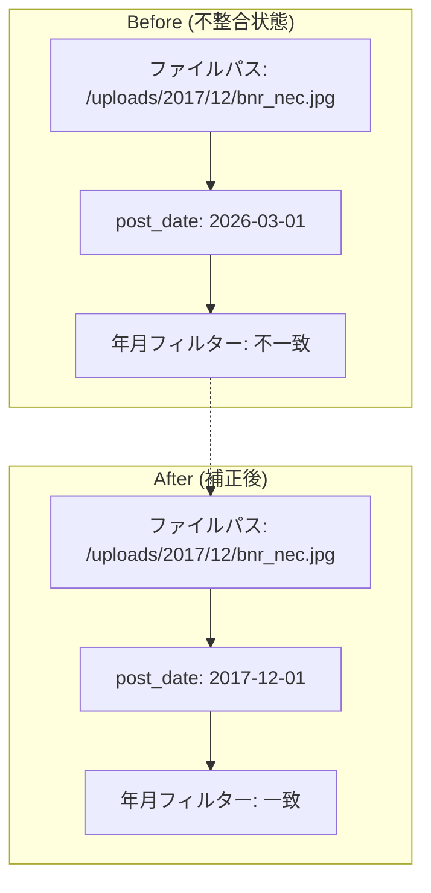
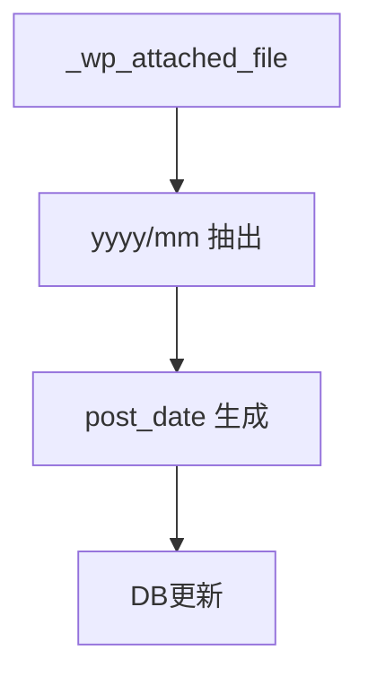

<!-- 
目的：「想定ユースケース、解決する課題、処理フロー (Before/After)」の明文化
 -->

# S2J MediaLibrary Date Corrector - コンセプト

## 1. 想定ユースケース

本プラグインは、既存のメディアファイルを WordPress 環境へ後から取り込むケースを主な対象としています。

特に以下のような状況を想定しています:

* 既存サイトや旧環境から、`wp-content/uploads/yyyy/mm` 構造を維持したままファイルを移行した場合
* FTP やローカルコピーにより、メディアファイルのみを先に配置した場合
* Bulk Media Register 等のツールを用いて、ファイルを一括でメディアライブラリに登録した場合

これらの操作において、ファイル自体は正しいディレクトリ構造に配置される一方で、WordPress のメディア情報 (特に `post_date`) は現在日時で登録されることがあります。

その結果、メディアライブラリの「年月フィルター」と実際のファイル配置が一致せず、メディア管理に支障をきたします。

本プラグインは、このような一括取り込み後の環境において、メタデータの整合性を回復するために利用されます。

## 2. 解決する課題 (Problem Statement)

WordPress のメディアライブラリは、以下の2つの情報を独立して管理しています:

* ファイルパス (`_wp_attached_file`)
* 投稿日時 (`post_date`)

通常のアップロードではこれらは一致しますが、一括登録ツールを利用した場合、以下の不整合が発生します:

* ファイルは `uploads/yyyy/mm` に存在する
* しかし `post_date` は登録時の現在日時となる

この不整合により、以下の問題が発生します:

* メディアライブラリの年月フィルターが正しく機能しない
* 時系列ベースのメディア管理が困難になる
* 過去コンテンツの再利用・検索性が低下する

この問題は WordPress 標準機能では解決できず、手動修正またはスクリプトによる補正が必要となります。

本プラグインは、この「ファイル構造とメタデータの不一致」という課題を解消することを目的とします。

## 3. 本プラグインのスコープ外

本プラグインは、「パスにもとづく `post_date` 補正」に限定します。次のような処理は、対象外です。

* ファイルの物理移動
* EXIF ベースの日時補正
* サムネイル再生成

## 4. 処理フロー (Before/After)

本プラグインは、「データの正規化」ではなく、あくまで「既存データの補正」に焦点を当てています。
そのため、処理は冪等性を考慮し、再実行可能な設計とすることを前提とします。

### Before (不整合状態)

```text
ファイルパス：
  wp-content/uploads/2017/12/bnr_nec.jpg

メタデータ：
  post_date = 2026-03-01

結果：
  ・「2017年12月」でフィルター → 表示されない
  ・検索性・整理性が低下
```

### After (補正後)

```text
ファイルパス：
  wp-content/uploads/2017/12/bnr_nec.jpg

メタデータ：
  post_date = 2017-12-01

結果：
  ・「2017年12月」でフィルター → 正常表示
  ・ファイル構造とメタ情報が一致
```



### 補正ロジック (概要)

本プラグインは、以下の手順で補正します:

1. `_wp_attached_file` からファイルパスを取得
2. パス中の `yyyy/mm` を抽出
3. `post_date` を `yyyy-mm-01 00:00:00` に補正
4. 必要に応じて選択的または一括で更新



### 操作フロー (UI)

* メディアライブラリ画面に「年月 (パス)」などの補助列を追加
* `post_date` との不一致を視覚的に確認
* チェックボックスにより対象メディアを選択
* 一括補正
