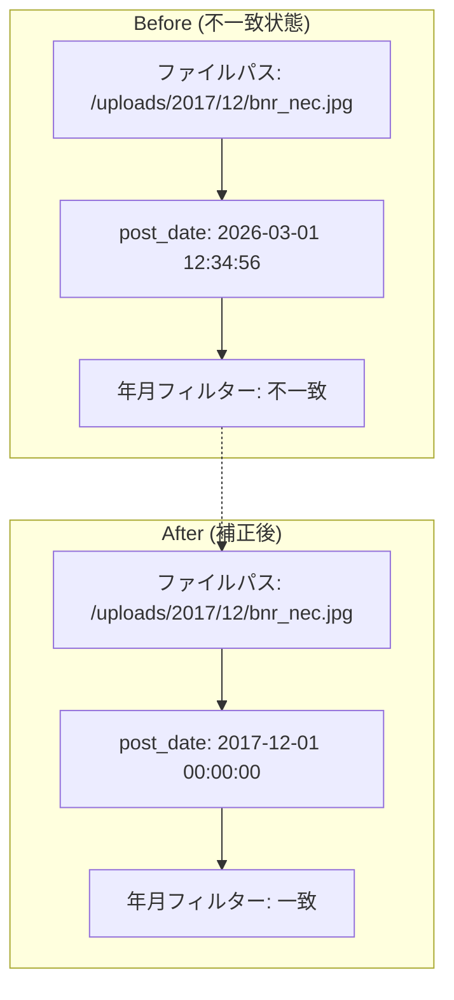
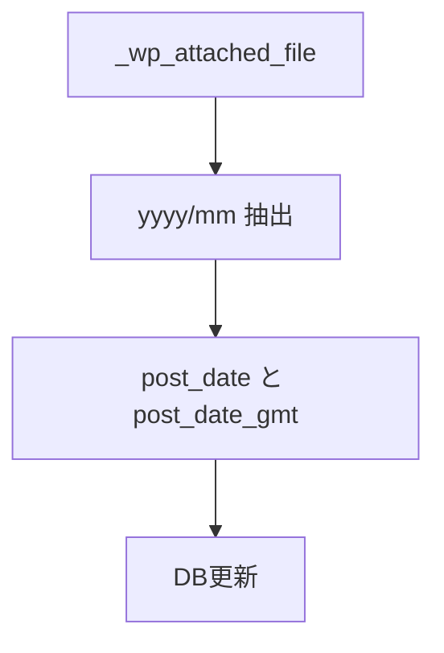

<!-- 
目的：「想定ユースケース、解決する課題、処理フロー (Before/After)」の明文化
 -->

# S2J MediaLibrary Date Corrector - コンセプト

## 前提条件

* ファイルを、正しいディレクトリ構造に配置すること。
* `_wp_attached_file` を、正しい値に設定すること。

## 1. 想定ユースケース

本プラグインは、既存のメディアファイルを WordPress 環境に後から取り込むケースを主な対象としています。

特に下記のような状況を想定しています。

* 既存サイトや旧環境から、`wp-content/uploads/yyyy/mm` 構造を維持したままファイルを移行した場合
* FTP やローカルコピーにより、メディアファイルのみを先に配置した場合
* [Bulk Media Register](https://ja.wordpress.org/plugins/bulk-media-register/) 等のツールを用いて、ファイルを一括でメディアライブラリに登録した場合

これらの操作において、ファイル自体は正しいディレクトリ構造に配置され `_wp_attached_file` もそれに合う一方で、WordPress のメディア情報 (特に `post_date`) は現在日時で登録されることがあります。

その結果、メディアライブラリの「年月フィルター」と `_wp_attached_file` 先頭の `yyyy/mm` が一致せず、メディア管理に支障をきたします。補正の Source of Truth は `_wp_attached_file` です。ディスク上の実ファイルは読みません。

本プラグインは、このような一括取り込み後の環境において、メタデータの整合性を回復するために利用されます。

メディアライブラリの List View では、表示中のページに「不一致」があると、日付とファイルパスの年月がずれているので補正するよう案内します。データ移行に限らず、複数ファイルの一括取り込みのあとも同じです。設定画面で、この案内だけを消せます。

## 2. 解決する課題 (Problem Statement)

WordPress のメディアライブラリは、下記の2つの情報を独立して管理しています。

* ファイルパス (`_wp_attached_file`)
* 投稿日時 (`post_date`)

通常のアップロードではこれらは一致しますが、一括登録ツールを利用した場合、下記の不一致 (課題説明では不整合とも呼ぶ。UI の差分列「不一致」と同義) が発生します。

* `_wp_attached_file` の先頭は、`yyyy/mm/` である (物理配置の前提と一致する想定)。
* しかし `post_date` は、登録時の現在日時になる。

この不一致により、下記の問題が発生します。

* メディアライブラリの年月フィルターが正しく機能しない。
* 時系列ベースのメディア管理が困難になる。
* 過去コンテンツの再利用・検索性が低下する。

この問題は WordPress 標準機能では解決できず、手動修正またはスクリプトによる補正が必要となります。

本プラグインは、この「`_wp_attached_file` の年月と `post_date` の不一致」(差分列の不一致) という課題を解消することを目的とします。

## 3. 本プラグインのスコープ外

本プラグインは、「パスにもとづく `post_date` 補正」に限定します。下記のような処理は、対象外です。

* ファイルの物理移動
* EXIF ベースの日時補正
* サムネイル再生成
* メタデータの再生成

## 4. 処理フロー (Before/After)

本プラグインは、「データの正規化」ではなく、あくまで「既存データの補正」に焦点を当てています。
そのため、処理は「[冪等性 (べきとうせい)](./architecture.md#冪等性-べきとうせい)」を考慮し、再実行可能な設計とすることを前提とします。

### Before (不一致状態)

```text
ファイルパス:
  wp-content/uploads/2017/12/bnr_nec.jpg

メタデータ:
  post_date = 2026-03-01 12:34:56 (サイト TZ。例)

結果:
  ・「2017年12月」でフィルター → 表示されません。
  ・検索性・整理性が低下します。
```

### After (補正後)

```text
ファイルパス:
  wp-content/uploads/2017/12/bnr_nec.jpg

メタデータ:
  post_date = 2017-12-01 00:00:00 (サイト TZ)

結果:
  ・「2017年12月」でフィルター → 正常に表示されます。
  ・ファイル構造とメタ情報が一致します。
```


```mermaid
flowchart

subgraph Before["Before (不一致状態)"]
  A1["ファイルパス: /uploads/2017/12/bnr_nec.jpg"]
  A2["post_date: 2026-03-01 12:34:56"]
  A3["年月フィルター: 不一致"]
  A1 --> A2 --> A3
end

subgraph After["After (補正後)"]
  B1["ファイルパス: /uploads/2017/12/bnr_nec.jpg"]
  B2["post_date: 2017-12-01 00:00:00"]
  B3["年月フィルター: 一致"]
  B1 --> B2 --> B3
end

A3 -.-> B1
```

### 補正ロジック (概要)

本プラグインは、下記の手順で補正します。

1. `_wp_attached_file` から相対パスを取得する (ディスクは読まない)。
2. パス先頭の `yyyy/mm` を、データ辞書の正規表現で抽出する。先頭でなければ補正しない。年は1000以上、9999以下である (詳細は [データ辞書](./data_dictionary.md#パス形式の前提と例外))。
3. `post_date` をサイトのローカル時刻 `yyyy-mm-01 00:00:00` にする。`post_date_gmt` は、その文字列を `get_gmt_from_date` に渡した値である。両方を同じ `wp_update_post` で書く。`post_modified` と `post_modified_gmt` には、取得済みの値を **必ず** 渡す (キー省略禁止)。
4. 右記のいずれかで更新する。行の Date Correct、チェックした ID の一括 Date Correct、または Date Correct (All) である。


```mermaid
flowchart TD
  A["_wp_attached_file"] --> B["yyyy/mm 抽出"]
  B --> C["post_date と post_date_gmt"]
  C --> D["DB更新"]
```

### 操作フロー (UI)

画面の契約は、[管理画面の UI 仕様](./admin_ui_spec.md) です。ここでは、同じ列と操作を要約します。

* 足す列は「年月 (パス)」と「差分」である。差分は、その列の文字 (一致、不一致、不明) で見る。
* 行の Date Correct。チェックは不要で、その行の ID を `/attachments/correct` に送る。
* 一括の Date Correct。チェックした ID だけを `/attachments/correct` に送る。チェックがなければ実行しない。
* Date Correct (All)。一括メニューの外である。確認のあと、いまの検索とフィルターを `/attachments/correct-query` に送る。
