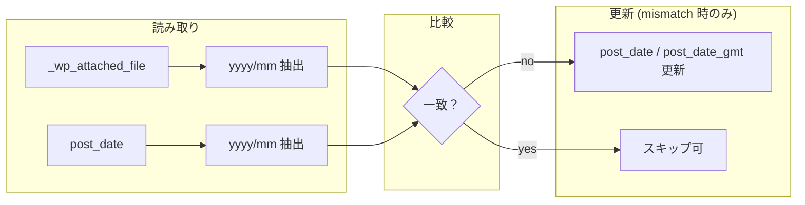

<!--
目的：「モデルの型、設定配列、CPT、メタキー、option、データフロー、データ更新内容」の明文化
-->

# S2J MediaLibrary Date Corrector - データ辞書

## 1. 投稿タイプ・カスタム投稿タイプ (CPT)

本プラグインは **新しい CPT を登録しない**。対象は WordPress コアの **メディア** のみである。

| 投稿タイプ | 用途 |
|------------|------|
| `attachment` | メディアライブラリの各行。`post_date` の補正対象 |

---

## 2. データベース上の主要フィールド

### 2.1 `wp_posts` (attachment)

| カラム | 説明 | 本プラグインでの扱い |
|--------|------|----------------------|
| `ID` | 添付 ID | 補正対象のキー |
| `post_type` | 常に `attachment` | フィルター条件 |
| `post_date` | メディアの「日付」として UI・年月フィルターに使用 | **補正の主対象** (コンセプトの「不整合」の一方) |
| `post_date_gmt` | UTC 日時 | `post_date` 変更時、コア慣例に合わせ **整合を取る** (サイトのタイムゾーン設定を考慮) |
| `post_modified` / `post_modified_gmt` | 最終更新 | **原則変更しない** (メディアの実質コンテンツ変更ではないため。運用上 `modified` を動かす方針にする場合は、別途仕様化) |

### 2.2 `wp_postmeta`

| メタキー | 説明 | 本プラグインでの扱い |
|----------|------|----------------------|
| `_wp_attached_file` | アップロード相対パス (例: `2017/12/bnr_nec.jpg`) | **年月抽出の「Source Truth」** (コンセプトの「不整合」の他方) |

その他のメタ (`_wp_attachment_metadata` 等) は、本プラグインの **初期スコープでは読み取り専用** とする。寸法・サムネイルパスと日付の矛盾を直す要件が出た場合は、別タスクで拡張する。

## 更新ルール

### `post_date`

* yyyy-mm-01 00:00:00 に正規化
* GMT も同時更新

### `_wp_attached_file`

* 参照のみ (更新しない)

---

## 3. 設定配列・オプション (options)

初期リリースでは、**必須の option は定義しない** (機能が単純なため)。

将来、以下を `option` または `site_option` で保持する余地がある：

| キー (例) | 用途 |
|------------|------|
| `s2j_mldc_batch_size` | REST の1回あたりの最大件数 |
| `s2j_mldc_last_run_stats` | 最終実行の集計 (任意・デバッグ) |

**トランジェント** で一時ジョブ ID を保持する拡張もあり得るが、スコープ外なら使用しない。

---

## 4. モデルの型 (論理/API での表現)

管理 UI と REST の間で受け渡す **論理モデル** (TypeScript / OpenAPI 的な定義の言語化) を次のように置く。実装時のインターフェース名は任意。

### 4.1 `PathYearMonth`

パスから得た年月 (比較キー)。

| フィールド | 型 | 説明 |
|------------|-----|------|
| `year` | `number` | 4桁年 |
| `month` | `number` | 1–12 |
| `label` | `string` (任意) | 表示用 `yyyy/mm` |

### 4.2 `MismatchStatus`

[管理画面 UI 仕様](./admin_ui_spec.md) の「MATCH / MISMATCH」に対応。

| 値 | 意味 |
|----|------|
| `match` | `post_date` の年月とパス年月が一致 |
| `mismatch` | 不一致 (補正候補) |
| `unknown` | `_wp_attached_file` が無い・パース不可など |

### 4.3 `AttachmentDateRow` (一覧/プレビュー用)

| フィールド | 型 | 説明 |
|------------|-----|------|
| `id` | `number` | 添付 ID |
| `postDateYm` | `string` | `post_date` 由来の `yyyy/mm` (比較用) |
| `pathYm` | `string \| null` | パス由来の `yyyy/mm` |
| `status` | `MismatchStatus` | 差分列の根拠 |
| `suggestedPostDate` | `string` (任意) | 補正後候補 ISO 風または `Y-m-d H:i:s` (サイト TZ) |

### 4.4 `CorrectionResult` (補正 API レスポンスの1件)

| フィールド | 型 | 説明 |
|------------|-----|------|
| `id` | `number` | 添付 ID |
| `ok` | `boolean` | 更新成功 |
| `skipped` | `boolean` (任意) | 既に一致のためスキップ等 |
| `error` | `string` (任意) | 失敗理由コードまたはメッセージ |

---

## 5. データフロー

1. **READ**: 対象 `attachment` の `post_date` と `get_post_meta( ID, '_wp_attached_file', true )` を取得。
2. **NORMALIZE**: パス先頭の `yyyy/mm` を正規表現等で抽出 (先頭にサブディレクトリがある運用の場合は仕様を追加)。
3. **COMPARE**: 日 (dd) と時刻は無視し、年月のみ比較 ([管理画面 UI 仕様](./admin_ui_spec.md))。
4. **WRITE**: `mismatch` のときのみ `wp_update_post` 等で `post_date` / `post_date_gmt` を更新。

---

## 6. データ更新内容 (まとめ)

| 対象 | 更新内容 |
|------|----------|
| `wp_posts.post_date` | パス上の `yyyy/mm` に対応する **`yyyy-mm-01 00:00:00`** (サイトのローカルタイム) へ変更 |
| `wp_posts.post_date_gmt` | 上記に対応する GMT (`get_gmt_from_date` 等で算出) |
| `_wp_attached_file` | **変更しない** |
| その他メタ | 初期スコープでは **変更しない** |

冪等性：`match` の項目を再実行しても、スキップまたは no-op にできるようサービス層で判定する。

---

## 7. セキュリティ・整合性 (データ観点)

* 更新対象 ID は必ず **`attachment` 且つ、権限のある投稿** に限定する。
* パスから抽出した年月が不正・欠損の場合は **`unknown`** として UI 表示し、デフォルトでは一括補正から除外する。
