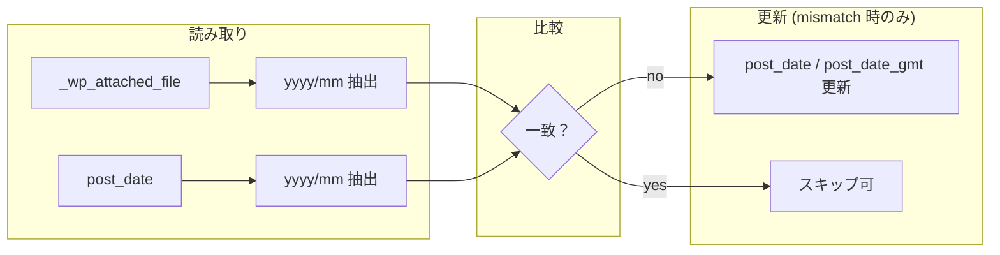

<!--
目的：「モデルの型、設定配列、CPT、メタキー、option、データフロー、データ更新内容」の明文化
-->

# S2J MediaLibrary Date Corrector - データ辞書

## 投稿タイプ・カスタム投稿タイプ (CPT)

本プラグインは **新しい CPT を登録しません**。対象は WordPress コアの **メディア** のみです。

| 投稿タイプ | 用途 |
|------------|------|
| `attachment` | メディアライブラリの各行に相当し、`post_date` の補正対象 |

## データベース上の主要フィールド

### `wp_posts` (attachment)

| カラム | 説明 | 本プラグインでの扱い |
|--------|------|----------------------|
| `ID` | 添付ファイルの ID です | 補正対象のキーです |
| `post_type` | 常に `attachment` です | フィルター条件です |
| `post_date` | メディアの「日付」として、UI や年月フィルターに使用されます | **補正の主対象です** (コンセプトの「不整合」の一方です) |
| `post_date_gmt` | UTC の日時です | `post_date` を変更する際、コアの慣例に合わせ **整合を取ります** (サイトのタイムゾーン設定を考慮します) |
| `post_modified` / `post_modified_gmt` | 最終の更新日時です | **原則として変更しません** (メディアの実質的なコンテンツ変更ではないためです。運用上 `modified` を更新する方針にする場合は、別途仕様化します) |

### `wp_postmeta`

| メタキー | 説明 | 本プラグインでの扱い |
|----------|------|----------------------|
| `_wp_attached_file` | アップロード相対パスです (例: `2017/12/bnr_nec.jpg`) | **年月抽出の「Source Truth」です** (コンセプトの「不整合」の他方です) |

その他のメタ (`_wp_attachment_metadata` 等) は、本プラグインの **初期スコープでは読み取り専用** とします。寸法・サムネイルパスと日付の矛盾を直す要件が出た場合は、別タスクで拡張します。

## 更新ルール

補正で変更する/しないフィールドの方針を、次の **更新ポリシー** に集約します。

## 更新ポリシー

* `post_date`:
  * `yyyy-mm-01 00:00:00` に補正
  * GMT も同時更新

* `_wp_attached_file`:
  * 読み取り専用です (変更しません)

## 設定配列・オプション (options)

初期リリースでは、**必須の option は定義しません** (機能が単純なため)。

将来、以下を `option` または `site_option` で保持する余地があります。

| キー (例) | 用途 |
|------------|------|
| `s2j_mldc_batch_size` | REST の1回あたりの最大件数です |
| `s2j_mldc_last_run_stats` | 最終実行の集計です (任意・デバッグ用) |

**Transient** で一時ジョブ ID を保持する拡張もあり得ますが、スコープ外なら使用しません。

## モデルの型 - 論理/API での表現

管理 UI と REST の間で受け渡す **論理モデル** (TypeScript / OpenAPI 的な定義の言語化) を次のように置きます。実装時のインターフェース名は任意です。

### `PathYearMonth`

パスから得た年月 (比較キー) です。

| フィールド | 型 | 説明 |
|------------|-----|------|
| `year` | `number` | 西暦4桁の年 |
| `month` | `number` | 1〜12の月 |
| `label` | `string` (任意) | 表示用の `yyyy/mm` |

### `MismatchStatus`

[管理画面 UI 仕様](./admin_ui_spec.md) の「MATCH / MISMATCH」に対応します。

| 値 | 意味 |
|----|------|
| `match` | `post_date` の年月とパス年月が一致 |
| `mismatch` | 年月が一致しておらず、補正候補 |
| `unknown` | `_wp_attached_file` がない、またはパース不可などの状態 |

### `AttachmentDateRow` - 一覧/プレビュー用

| フィールド | 型 | 説明 |
| ------------------- | ---------------- | ------------------------------------------ |
| `id` | `number` | 添付ファイル ID |
| `postDateYm` | `string \| null` | `post_date` 由来の `yyyy/mm` (抽出不可の場合は、`null`) |
| `pathYm` | `string \| null` | パス由来の `yyyy/mm` (未設定またはパース不可で、`null`) |
| `status` | `MismatchStatus` | 差分状態 (`unknown` を含む) |
| `suggestedPostDate` | `string \| null` | 補正候補 (生成不可の場合は、`null`) |

* `suggestedPostDate`: ISO 風の文字列、またはサイトのタイムゾーンにおける `Y-m-d H:i:s` 形式です。

### 欠損データの扱い - nullable、unknown

本プラグインでは、`_wp_attached_file`、`post_date`、およびそれらから導出される値が取得できない場合を、**例外ではなく通常状態として扱います**。

#### 基本方針

* 欠損データは、`null` または `unknown` として表現します。
* 処理を中断せず、UI に状態として反映します。
* 一括処理においては、デフォルトでスキップ対象とします。

#### フィールド別定義

| フィールド | 型 | 欠損時の扱い |
| ------------------- | ---------------- | ---------------------------- |
| `_wp_attached_file` | `string` | 未設定または空の場合は、`null` |
| `pathYm` | `string \| null` | パース不可の場合は、`null` |
| `post_date` | `string` | 原則として存在。不正値の場合は、`unknown` 扱い |
| `postDateYm` | `string \| null` | 抽出不可の場合は、`null` |

#### ステータスとの関係

欠損データが存在する場合、`MismatchStatus` は次のように扱います。

| 状態 | 条件 |
| ---------- | ------------------------------------------- |
| `unknown` | `pathYm === null` または `postDateYm === null` の場合 |
| `match` | 両方が存在し、年月が一致している場合 |
| `mismatch` | 両方が存在し、かつ年月が一致していない場合 |

#### UI との関係

* `unknown` は、「不明」または「判定不可」として表示します。
* デフォルトでは、補正対象に含めません。
* 明示的に選択された場合のみ、処理対象とします (将来拡張)。

#### REST API との関係

* `results` においては、`skipped` または専用コードで表現します。
* `summary.skipped` に含めます。

#### 設計意図

* データ不整合を「例外」ではなく「状態」として扱います。
* バッチ処理における停止を防ぎます。
* UI、API、サービス間の分岐を、単純化します。

### `CorrectionResult` - 補正 API レスポンスの1件

| フィールド | 型 | 説明 |
|------------|-----|------|
| `id` | `number` | 添付 ID |
| `ok` | `boolean` | 更新成功 |
| `skipped` | `boolean` (任意) | すでに一致のためスキップ等 |
| `error` | `string` (任意) | 失敗理由コードまたはメッセージ |

## データフロー

1. **READ**:
  * 対象 `attachment` の `post_date` と `get_post_meta( ID, '_wp_attached_file', true )` を取得します。
2. **NORMALIZE**:
  * パス先頭の `yyyy/mm` を正規表現等で抽出します (先頭にサブディレクトリがある運用の場合は、仕様を追加します)。
  * 補足 (欠損データ)
    * `_wp_attached_file` が未設定または不正な場合、`pathYm` は `null` とします。
    * `post_date` が不正な場合、`postDateYm` は `null` とします。
    * いずれかが `null` の場合、比較は行わず `unknown` とします。
3. **COMPARE**:
  * 日 (dd) と時刻は無視し、年月のみ比較します ([管理画面 UI 仕様](./admin_ui_spec.md))。
4. **WRITE**:
  * `mismatch` のときのみ `wp_update_post` 等で `post_date` / `post_date_gmt` を更新します。

## データ更新内容 (まとめ)

| 対象 | 更新内容 |
|------|----------|
| `wp_posts.post_date` | パス上の `yyyy/mm` に対応する **`yyyy-mm-01 00:00:00`** (サイトのローカルタイム) へ変更します |
| `wp_posts.post_date_gmt` | 上記に対応する GMT を `get_gmt_from_date` 等で算出します |
| `_wp_attached_file` | **変更しません** |
| その他メタ | 初期スコープでは **変更しません** |

冪等性 (べきとうせい): `match` の項目を再実行しても、スキップまたは no-op にできるよう、サービス層で判定します。

## セキュリティ・整合性 (データ観点)

* 更新対象 ID は、必ず **`attachment` かつ、権限のある投稿** に限定します。
* パスから抽出した年月が不正・欠損の場合は、**`unknown`** として UI に表示し、デフォルトでは一括補正から除外します。
