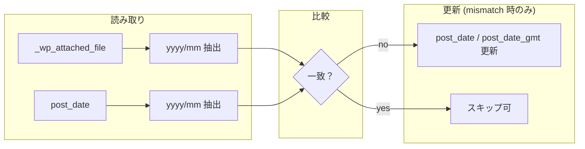

<!--
目的：「モデルの型、設定配列、CPT、メタキー、option、データフロー、データ更新内容」の明文化
-->

# S2J MediaLibrary Date Corrector - データ辞書

## 投稿タイプ・カスタム投稿タイプ (CPT)

本プラグインは、**新しい CPT を登録しません**。対象は、WordPress コアの **メディア** のみです。

| 投稿タイプ | 用途 |
| --- | --- |
| `attachment` | メディアライブラリの各行に相当し、`post_date` の補正対象です |

## データベース上の主要フィールド

### `wp_posts` (attachment)

| カラム | 説明 | 本プラグインでの扱い |
| --- | --- | --- |
| `ID` | 添付ファイルの ID です | 補正対象のキーです |
| `post_type` | 常に `attachment` です | フィルター条件です |
| `post_date` | メディアの「日付」として、UI や年月フィルターに使用されます | **補正の主対象です** (コンセプトの「不整合」の一方です) |
| `post_date_gmt` | UTC の日時です | `post_date` を変更する際、コアの慣例に合わせ **整合を取ります** (サイトのタイムゾーン設定を考慮します) |
| `post_modified` / `post_modified_gmt` | 本文や添付の中身を編集した時刻です | **変更しません**。補正は内容の編集ではないためです |

### `wp_postmeta`

| メタキー | 説明 | 本プラグインでの扱い |
| --- | --- | --- |
| `_wp_attached_file` | アップロード相対パスです (例: `2017/12/bnr_nec.jpg`) | **年月抽出の「Source Truth」です** (コンセプトの「不整合」の他方です) |

その他のメタ (`_wp_attachment_metadata` 等) は、本プラグインの **初期スコープでは読み取り専用** とします。寸法・サムネイルパスと日付の矛盾を直す要件が出た場合は、別タスクで拡張します。

#### 設計方針 (規約)

* パスから年月を読めない場合は、エラーではなく一覧の `unknown` とします。デフォルトの一括補正と Date Correct (All) には入れません。補正リクエストに入ったときは `skipped` とし、`error` にはしません。

#### パス形式の前提と例外

本プラグインは、`_wp_attached_file` の先頭が `yyyy/mm/` であることを前提とします。値は、アップロード基準ディレクトリからの相対パスです。例は `2017/12/file.jpg` です。

切り出しは、次の正規表現だけを使います。

```text
^(\d{4})/(0[1-9]|1[0-2])/
```

年は1000以上、9999以下です。この範囲外は、正規表現に合っても読めないものとして扱います。MySQL の `DATETIME` が受け付けないためです。

月はゼロ埋めの `01` から `12` です。文字列の途中にある数字は使いません。`2017/13` や `2017/1/file.jpg` は読みません。

#### 非対応ケース

下記の場合は、一覧を `unknown` とします。補正リクエストに入ったときは、更新せず `skipped` とします。

* 先頭が、上記の正規表現に合わない
* 年が1000未満、または9999を超える
* `_wp_attached_file` が未設定または空
* カスタムディレクトリ構成で、先頭が `yyyy/mm/` でない

## 更新ルール

補正で変更する/しないフィールドの方針を、次の **更新ポリシー** に集約します。

## 更新ポリシー

* `_wp_attached_file`:
  * 読み取り専用です (変更しません)。

* `post_date`:
  * サイトのタイムゾーンで、`yyyy-mm-01 00:00:00` 形式に補正します。
  * パスに日も時刻もないので、1日の0時に固定します。
* `post_date_gmt`:
  * 上記のローカル時刻を `get_gmt_from_date` に渡した値です。
  * ローカル時刻と同じ文字列は入れません。

### 日付正規化とタイムゾーン

補正後の `post_date` は、**WordPress 管理画面の「設定 > 一般 > タイムゾーン」にもとづくローカル時刻** で、`yyyy-mm-01 00:00:00` 形式に正規化します。

`post_date_gmt` は、上記ローカル時刻から `get_gmt_from_date` により算出します。

#### 注意点

* UTC は直接計算しません。
* サマータイムやオフセットは、WordPress の内部関数に委譲します。

## 設定配列・オプション (options)

初期リリースでは、option を1つ定義します。キーは `s2j_mldc_mismatch_notice` です。型は真偽値です。未保存のときは、案内を出します。

意味は、メディアライブラリの List View で、表示中のページに「不一致」が1件でもあるとき、補正を促す案内を出すことです。一括取り込みのあとも、同じ案内です。見るのはそのページの attachment だけで、ライブラリ全体は数えません。保存は Settings API で、`manage_options` です。

列、行の Date Correct、一括の Date Correct、Date Correct (All) は、この option では切り替えません。補正 API は、この option では拒みません。

アップロード時の自動補正は、初期リリースでは置きません。

`s2j_mldc_batch_size`、`s2j_mldc_last_run_stats`、ジョブ ID 用の Transient は、初期リリースでは置きません。1リクエストの上限は100件で、コードに固定します。option にはしません。

## モデルの型 - 論理/API での表現

管理 UI と REST の間で受け渡す論理モデルを、次の型として置きます。初期リリースでは、この型がフィールドの契約です。管理画面の TypeScript は、これを手で写します。インターフェース名は、実装時に合わせてよいです。

### `PathYearMonth`

パスから得た年月 (比較キー) です。

| フィールド | 型 | 説明 |
| --- | --- | --- |
| `year` | `number` | 西暦4桁の年 |
| `month` | `number` | 1〜12の月 |
| `label` | `string` (任意) | 表示用の `yyyy/mm` |

### `MismatchStatus`

[管理画面 UI 仕様](./admin_ui_spec.md) の差分列に対応します。値は `match`、`mismatch`、`unknown` です。画面に出す文字は、次のとおりです。

* `match` は「一致」です。
* `mismatch` は「不一致」です。
* `unknown` は「不明」です。

この3つの文字は、PHP の差分列が gettext で出します。値そのものは翻訳しません。REST の `ResultItem.status` には、この3値を使いません。

| 値 | 画面の文字 | 意味 |
| --- | --- | --- |
| `match` | 一致 | `post_date` の年月とパス年月が一致 |
| `mismatch` | 不一致 | 年月が一致しておらず、補正候補 |
| `unknown` | 不明 | `_wp_attached_file` がない、または先頭が `yyyy/mm` でない状態です。`post_date` が読めなくても、パスの年月が取れる場合は含めません |

### `AttachmentDateRow` - 一覧列の論理モデル

| フィールド | 型 | 説明 |
| --- | --- | --- |
| `id` | `number` | 添付ファイル ID |
| `postDateYm` | `string \| null` | `post_date` 由来の `yyyy/mm` (抽出不可の場合は、`null`) |
| `pathYm` | `string \| null` | パス由来の `yyyy/mm` (未設定またはパース不可の場合は、`null`) |
| `status` | `MismatchStatus` | 差分状態 (`unknown` を含む) |

一覧の列にも REST の応答にも、補正候補の日時フィールドは出しません。書く文字列は、更新のときにサービスが作ります。

### 欠損データの扱い - nullable、unknown

本プラグインでは、`_wp_attached_file`、`post_date`、およびそれらから導出される値が取得できない場合を、**例外ではなく通常状態として扱います**。

#### 設計意図 (ゴール)

* データ不整合を「例外」ではなく「状態」として扱います。
* バッチ処理における停止を防ぎます。
* UI、API、サービス間の分岐を、単純化します。

#### 基本方針

* パスが読めない欠損は、`null` または一覧の `unknown` として表現します。
* 処理を中断せず、UI に状態として反映します。
* パスが読めない件は、デフォルトの一括補正から外します。リクエストに入ったときは `skipped` です。
* `post_date` が読めなくても、パスの年月が取れる件は補正します。

#### フィールド別定義

| フィールド | 型 | 欠損時の扱い |
| --- | --- | --- |
| `_wp_attached_file` | `string` | 未設定または空の場合は、`null` |
| `pathYm` | `string \| null` | パース不可の場合は、`null` |
| `post_date` | `string` | 原則として存在します。不正値でも `pathYm` があれば、パスの年月で補正します |
| `postDateYm` | `string \| null` | 抽出不可の場合は、`null` です。`pathYm` があるときは補正を続けます |

#### ステータスとの関係

欠損データが存在する場合、`MismatchStatus` は次のように扱います。

| 状態 | 条件 |
| --- | --- |
| `unknown` | `pathYm === null` |
| `match` | `pathYm` と `postDateYm` があり、年月が一致すること |
| `mismatch` | `pathYm` があり、`postDateYm` が `null` であるか、年月が一致しないこと |

#### UI との関係

* `unknown` は、差分列で「不明」と表示します。これは一覧の `MismatchStatus` です。
* デフォルトの一括補正と Date Correct (All) には、含めません。
* 行操作などで補正リクエストに入っても、更新しません。

#### REST API との関係

* `ResultItem.status` に `match`、`mismatch`、`unknown` は使いません。
* パスから年月を読めない件は、HTTP `200` の `skipped` です。`error` にはせず、再試行の対象にもしません。
* `message` を付けるときは、人間が読める文だけです。例は「ファイルパスから年月を読み取れないため、補正しません。」です。件別の機械可読コードは置きません。
* `summary.skipped` に含めます。`summary.failed` には含めません。
* 年月がすでに一致している件も `skipped` です。区別は `message` の文です。
* `post_date` が読めなくても、パスの年月が取れるときは更新します。この件は `skipped` にしません。

### TypeScript 型定義 (完全版)

本プラグインのデータ構造は、下記の TypeScript 型として定義します。

#### 設計方針 (規約)

* API レスポンスと UI 状態は、「同一構造」を共有します。
* `nullable` は、明示的に扱います。
* `unknown` を、「状態」として保持します。

#### 契約としての位置

本節の型が、初期リリースのフィールドの契約です。管理画面は、これを手で写します。

サーバーは、同じ形を `register_rest_route` の `args` で確かめます。PHP は zod を実行しません。

OpenAPI と zod は、初期リリースに置きません。後から機械可読な契約を足すときは、本辞書と [REST 仕様](./rest_api_spec.md) から OpenAPI を作り、そこからクライアントの型を生成します。zod は、ブラウザが応答を確かめる任意の層です。書き込みの正本にはしません。

#### MismatchStatus

```ts
type MismatchStatus = 'match' | 'mismatch' | 'unknown';
```

#### AttachmentDateRow

```ts
interface AttachmentDateRow {
  id: number;
  postDateYm: string | null;
  pathYm: string | null;
  status: MismatchStatus;
}
```

#### ResultStatus

```ts
type ResultStatus = 'success' | 'skipped' | 'error';
```

#### ResultItem

補正 API の1件は、この型だけを使います。

* `message` は、人間が読める文です。
* `status` が `error` のときは、`message` を必ず付けます。
* `success` と `skipped` では、`message` は任意です。
* 件別結果に、機械可読の理由コードは置きません。

```ts
interface ResultItem {
  id: number;
  status: ResultStatus;
  message?: string;
}
```

#### Summary

```ts
interface Summary {
  total: number; // その1リクエストの対象件数。一覧の全件数ではない
  processed: number;
  success: number;
  skipped: number;
  failed: number;
}
```

#### APIResponse

```ts
interface APIResponse {
  status: 'success' | 'partial' | 'error';
  summary: Summary;
  results: ResultItem[];
}
```

トップレベル `status` は、次のとおりです。

* `error` が1件もなく、`processed` が `total` と一致するときは `success` です。`skipped` だけでも同じです。
* `error` と、`success` または `skipped` が混ざるときは `partial` です。
* 処理した件がすべて `error` のときは `error` です。
* `processed < total` のときも `partial` です。

## データフロー


```mermaid
flowchart LR
  subgraph Read["読み取り"]
    A["_wp_attached_file"]
    B["post_date"]
    A --> P["yyyy/mm 抽出"]
    B --> Q["yyyy/mm 抽出"]
  end
  subgraph Compare["比較"]
    P --> C{"一致？"}
    Q --> C
  end
  subgraph Write["更新 (mismatch 時のみ)"]
    C -->|no| U["post_date / post_date_gmt 更新"]
    C -->|yes| S["スキップ可"]
  end
```

1. **READ**:
  * 対象 `attachment` の `post_date` と `get_post_meta( ID, '_wp_attached_file', true )` を取得します。
2. **NORMALIZE**:
  * パス先頭だけを、`^(\d{4})/(0[1-9]|1[0-2])/` で抽出します。年は1000以上、9999以下です。先頭にサブディレクトリがある場合は、`unknown` とします。
  * 補足 (欠損データ)
    * `_wp_attached_file` が未設定、または先頭が `yyyy/mm` でない場合、`pathYm` は `null` です。一覧は `unknown` とします。
    * `post_date` が不正な場合、`postDateYm` は `null` とします。`pathYm` があるときは `mismatch` とし、パスの年月で補正します。
    * `pathYm` が `null` の場合、比較は行わず `unknown` とします。
3. **COMPARE**:
  * 日 (dd) と時刻は無視し、年月のみ比較します ([管理画面 UI 仕様](./admin_ui_spec.md))。
4. **WRITE**:
  * `mismatch` のときだけ、`wp_update_post` を1回呼びます。
  * 同じ配列に、新しい `post_date`、`get_gmt_from_date` の `post_date_gmt`、取得済みの `post_modified` と `post_modified_gmt` を渡します。
  * コアは、`post_modified` と `post_modified_gmt` が空のときだけ現在時刻を入れます。値を渡せば、その値が残ります。
  * 書いたあとにもう一度更新して戻すことはしません。
  * `skipped` の件は、`wp_update_post` を呼びません。

## データ更新内容 (まとめ)

| 対象 | 更新内容 |
| --- | --- |
| `wp_posts.post_date` | パス上の `yyyy/mm` に対応する **`yyyy-mm-01 00:00:00`** (サイトのローカルタイム) に変更します |
| `wp_posts.post_date_gmt` | 上記のローカル時刻を `get_gmt_from_date` に渡した値です。同じ文字列は入れません |
| `wp_posts.post_modified` / `post_modified_gmt` | **変更しません**。`wp_update_post` には、取得済みの値を渡します |
| `_wp_attached_file` | **変更しません** |
| その他メタ | 初期スコープでは **変更しません** |

[冪等性 (べきとうせい)](./architecture.md#冪等性-べきとうせい): `match` の項目を再実行しても、スキップまたは no-op にできるよう、サービス層で判定します。

## セキュリティ・整合性 (データ観点)

* 更新対象 ID は、必ず **`attachment` かつ、権限のある投稿** に限定します。
* パスから年月を読めない場合は、一覧では **`unknown`** と表示し、デフォルトの一括補正と Date Correct (All) から外します。補正リクエストに入ったときは **`skipped`** です。`post_date` が読めなくても、パスの年月が取れるときは補正します。
